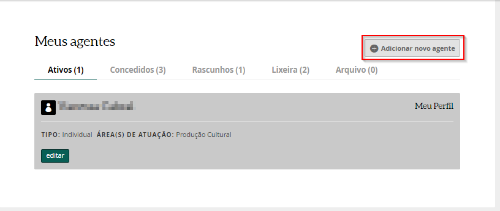
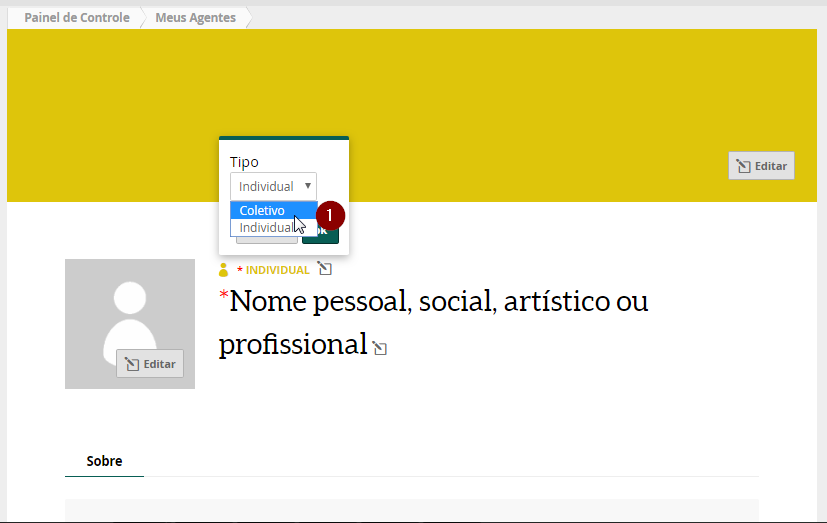
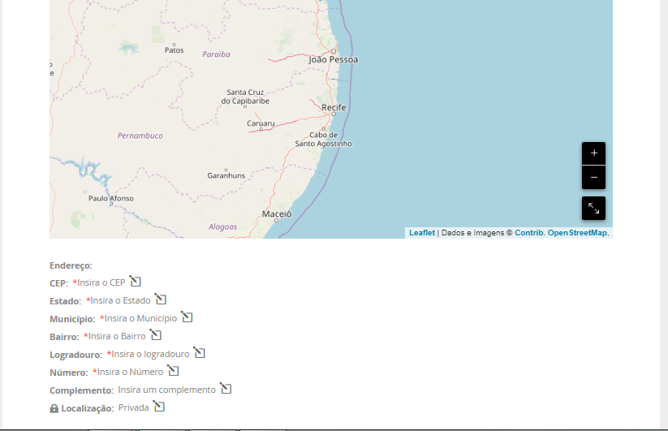
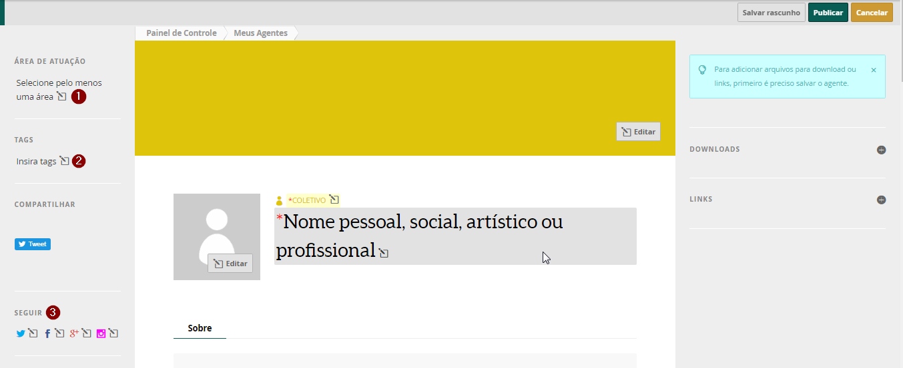
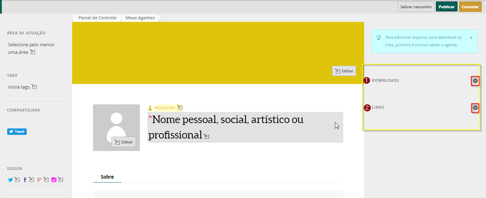
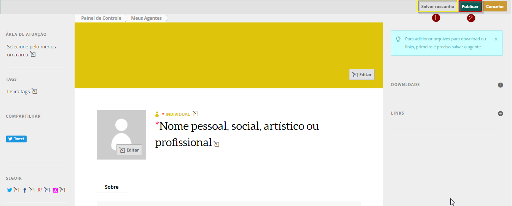
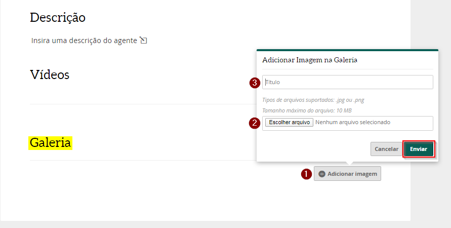
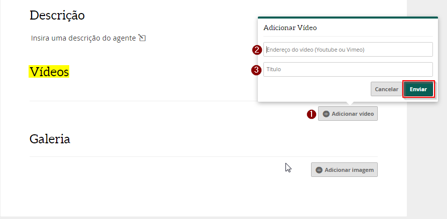
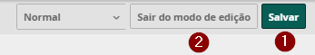

# Cadastro do Agente Coletivo

Primeiro, clique na foto do seu perfil e, em seguida, clique no nome ****`Meus Agentes`

Aqui você consegue visualizar todos os seus agentes cadastrados. Clique no botão `Adicionar novo agente`

O cadastro da Pessoa Jurídica ou Grupo Informal \(Agente Coletivo\) é muito semelhante ao cadastro de Pessoa Física \(Agente Individual\). Só são precisos alguns pequenos cuidados. Não esqueça de escolher, logo acima do nome, a opção `coletivo`.

### Informações obrigatórias para o cadastro

Preencha as informações obrigatórias para validar o seu perfil de agente coletivo. 

1. Nome pessoal, social, artístico ou profissional
2. Descrição curta
3. Nome ou Razão Social
4. Email Principal
5. Telefone Principal
6. Localização
7. Área de atuação


**OBSERVAÇÃO:** o Grupo Informal não precisa preencher o campo de CNPJ, Código de Natureza Jurídica e Código de Atividade Principal. 


O campo da localização fica logo abaixo e você deve digitar o seu endereço e indicar se outras pessoas podem ver sua localização \(opção: pública\) ou não \(opção: privada\).

1. CEP
2. Estado
3. Município
4. Bairro
5. Logradouro
6. Número
7. Complemento
8. Localização \(Privada ou Pública\)

O campo com a seleção da `área de atuação` fica na lateral. As opções aparecem na medida que você escreve. Você pode escolher quantas áreas quiser da lista de opções.

### Informações complementares

Use a seção de `TAGS` para inserir outra área de atuação que não esteja listada ou uma palavra chave sobre o seu perfil. As tags, assim como a área de atuação,podem ser utilizadas para que outras pessoas possam encontrar o perfil da Instituição ou Grupo. Você também pode inserir quantas tags quiser.

Também do lado direito, você encontra a seção `SEGUIR` com o ícone das redes sociais Twitter, Facebook, Instagram. Clicando em cada uma delas, você pode adicionar o endereço das suas redes sociais ao seu perfil do mapas.

Para anexar histórico, currículo, release, clipping de mídia ou outros tipos de documentos, vá para o topo da página e clique no sinal de `+` ao lado da guia ****`Downloads`, que está na lateral direita. Digite o título do documento, depois clique no botão `Escolher arquivo` e selecione, no seu computador, o documento desejado. Por fim, clique em**`enviar`**. Agora você verá que o documento aparecerá automaticamente na seção downloads.

Para incluir links clique no sinal de `+` ao lado da guia `links`, que está na lateral direita. Primeiro cole o endereço do link que você deseja incluir no perfil, depois digite o título que aparecerá e, por fim, clique no botão `Enviar`. Agora você verá que o link aparecerá automaticamente na seção links.

Depois que colocar todas as informações obrigatórias no Agente Coletivo, clica no botão `Salvar` ****`Rascunho`, em seguida clique em `Publicar`. 

Para adicionar as imagens, desça para a seção **galeria** e clique no botão `Adicionar imagem`. Em seguida, clique no botão`Escolher arquivo` e selecione, no seu computador, a imagem desejada, você pode colocar um **Título** na imagem.  Por fim, clique em enviar. Você verá que a imagem aparecerá automaticamente na seção galeria. Para inserir mais imagens, repita a mesma operação.


**Atenção:** As imagens precisam estar no formato JPG ou PNG


Para adicionar videos clique no botão `Adicionar vídeo`. Você pode adicionar o link de um vídeo que está no **youtube ou no vímeo**. Cole o link do vídeo no campo indicado abaixo, escreva um título e clique em `Enviar`. Feito isso, você verá que o vídeo será adicionado automaticamente na página do seu perfil.

Após incluir essas informações clique no botão `Salvar`, no canto superior da tela. Para visualizar o seu perfil coletivo com as informações clique no botão `Sair do modo de edição.` 

