# Como criar um Evento

Para criar um evento no Mapa Cultural, você precisa acessar o Painel de Controle. Existem dois caminhos para criar o seu evento. 

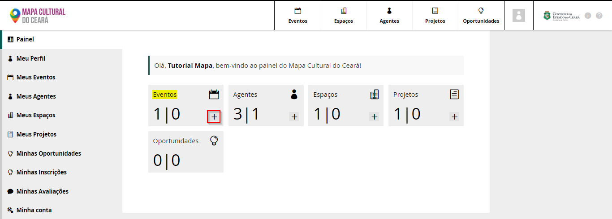

O primeiro pode ser feito no Painel de Controle, onde aparece as informações de Evento, Agentes, Espaços, Projetos e Oportunidade. Basta clicar no botão `+` para criar um novo evento.

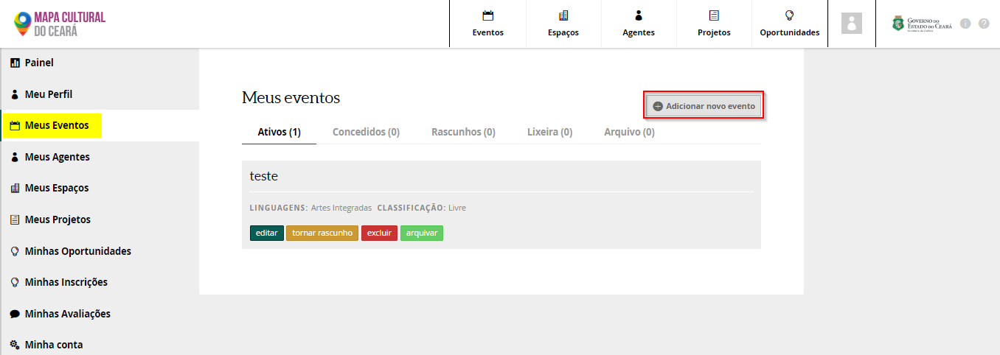

A segunda opção pode ser feito clicando em Meus Eventos, onde iriá aparecer informaçoes mais detalhadas de onde o eventos ficam, quando são criados. Basta clicar no botão `Adicionar novo evento`, para criar o seu evento. 

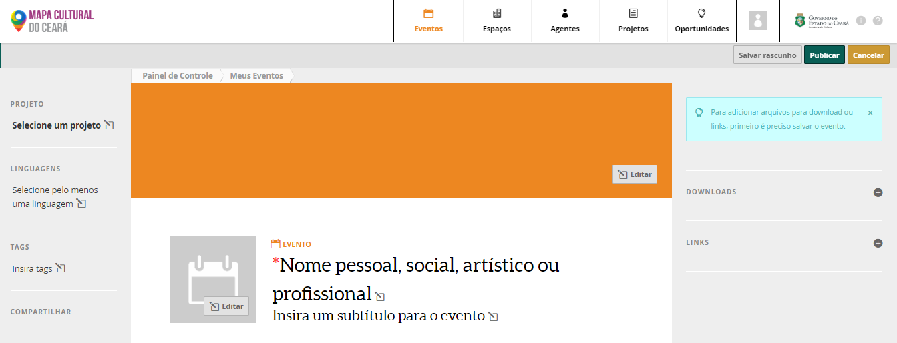

Ao clicar no botão o usuario será levando para a tela para criação do evento. E colocar as informações sobre o evento como: 

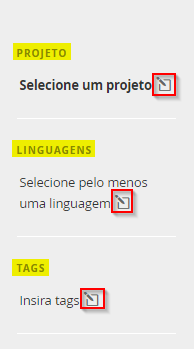

Projeto: O evento pode ser vinculado ao projeto que você criou dentro do Mapa Cultural. Para vincular ao projeto basta clicar no botão \(caneta dentro do quadrado\) e selecionar o projeto. 

Linguagem: Você pode selecionar a linguagem do evento, ele pode ser: Arte Visuais, Cursos ou Oficinas, Cultura Digital entre outros. 

Tag: Você pode colocar tag que podem ajudar na busca do seu evento dentro do Mapa Cultural

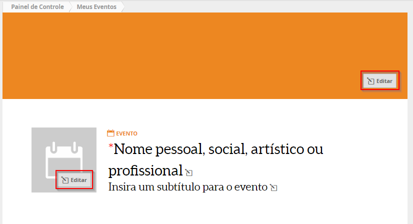

Você pode colocar um capa e avatar no evento, clicando no botão editar.

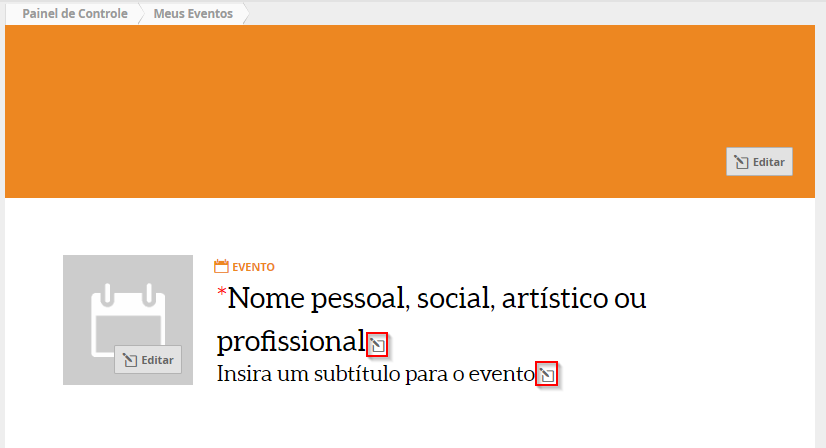

Precisar ser colocado um título para o evento, o subtítulo do evento é opcional.

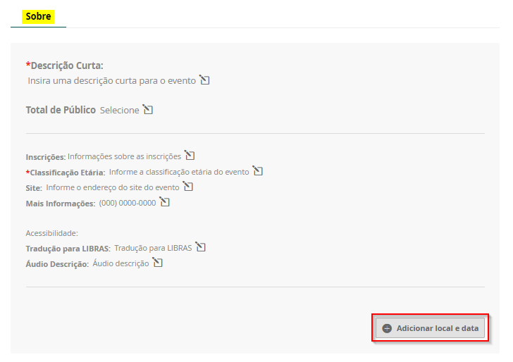

Coloque as informações completa do seu evento: Descrição curta, Total de Público, Inscrições, Classificação Etária, Site, Mais Informações, Tradução para Libras e Áudio Descrição.


Todos os itens com asterisco são obrigatoria


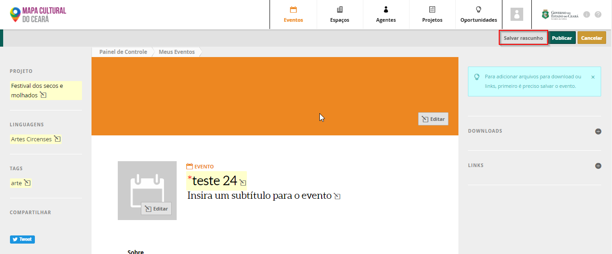

Após colocar as informações clique no botão salvar rascunho. E volte para o espaço Sobre, para colocar as informações de Data e Local

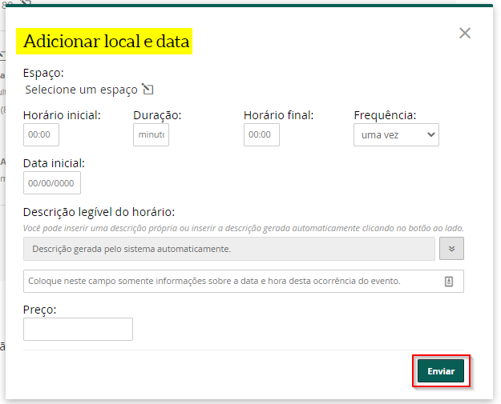

Informações adicionais e não obrigatorias, caso queira colocar uma descrição maior sobre o evento, essa informação pode ser colocar em Descrição. Se tiver video e fotos esses podem ser adicionados no respectivos botões Adicionar vídeo e Adicionar Imagem.

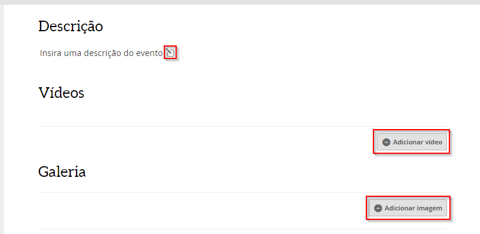

Você também pode colocar outros administradores do evento. Eles poderam fazer editar e fazer alterações no evento, caso seja necessario. Basta clicar no botão + para adicionar novos administradores. 

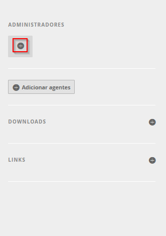

Após colocar das as informações do evento, clique no botão Publicar, para que o evento possa ficar visivel no Mapa da Cultura

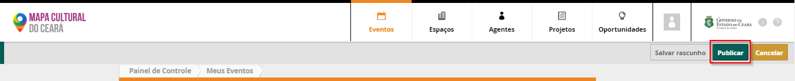

Caso seja necessario fazer alterações no evento, basta acessar o Painel de Controle e acesse Meus Eventos para editar. 

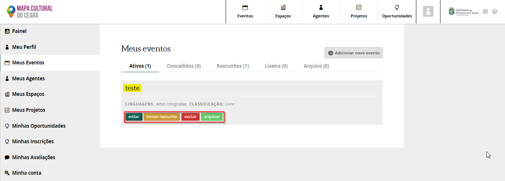

