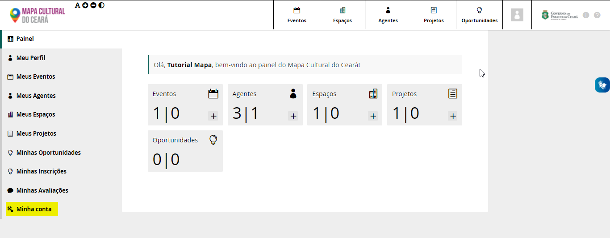
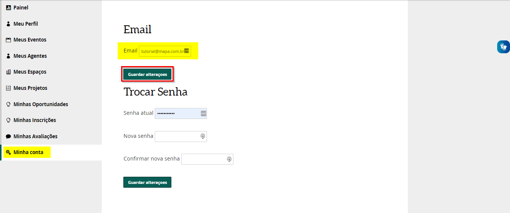

# Como solicitar a alteração de e-mail

A troca de email pode ser feito dentro da plataforma do Mapa Cultura  
Acesse o Painel de Controle e clique em `Minha Conta`

No campo EMAIL, digite o email que deseja e clique em `Guardar Alteração`

Outra forma é o usuario enviar um email para o **mapa@secult.ce.gov.br**. O email precisar ser enviado pelo agente cadastrado no Mapa da Cultura informando:   
1. Link do Agente Individual Cadastrado  
2. Email que deseja para alterar o registro  
3. Fotografia legivil do RG \(frente e verso\) e CPF   
4. Breve motivo da Alteração

