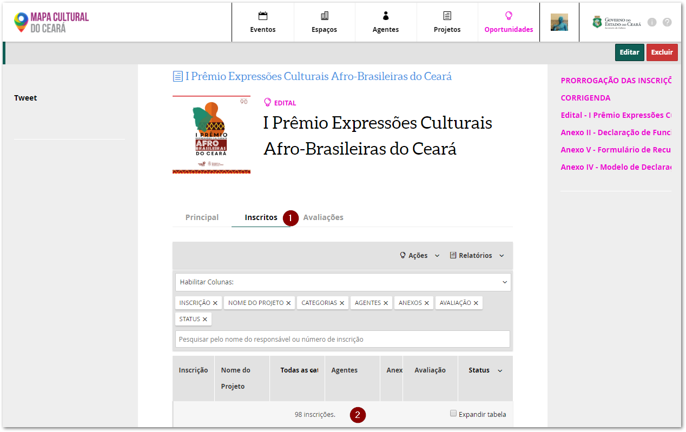
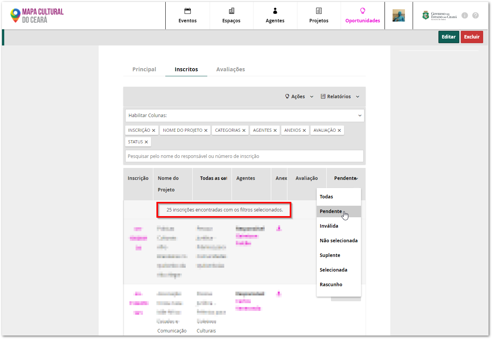
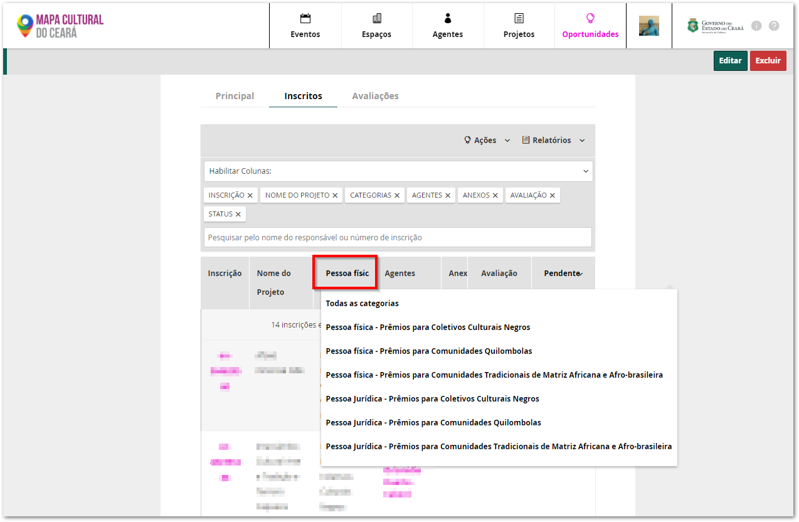
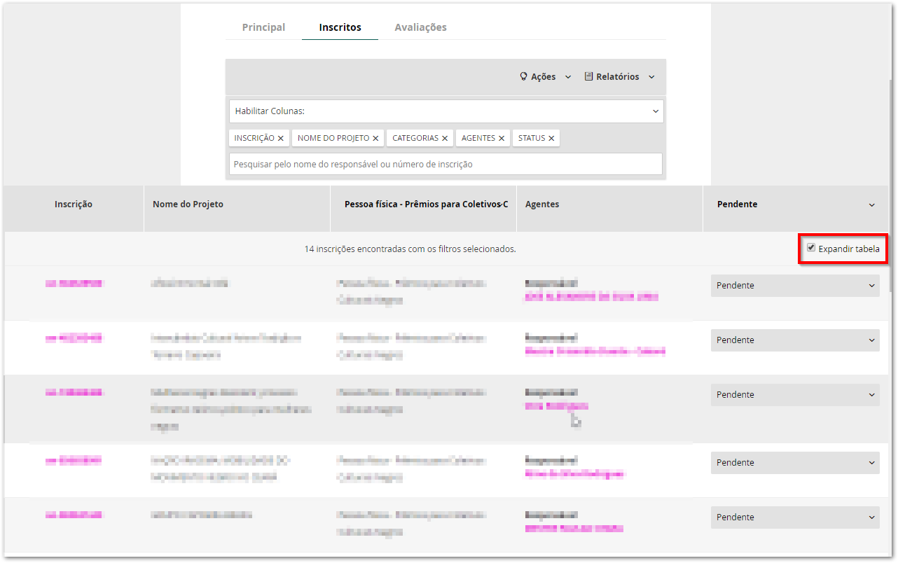

# Como acompanhar as inscrições

Você pode acompanhar a evolução das inscrições pelo painel do Mapas ou a partir de relatórios em planilhas.

### Painel de acompanhamento das inscrições

Primeiro encontre a oportunidade que gostaria de acompanhar clicando no menu `Oportunidades`. Depois digite o nome no campo de busca e clique na oportunidade desejada.

Depois clique na aba inscritos. 


As abas de inscritos e avaliações só aparecem os administradores da oportunidade.


dfgdfgdfg

dgfdgfdfgdfg

dfgfgdfgf

