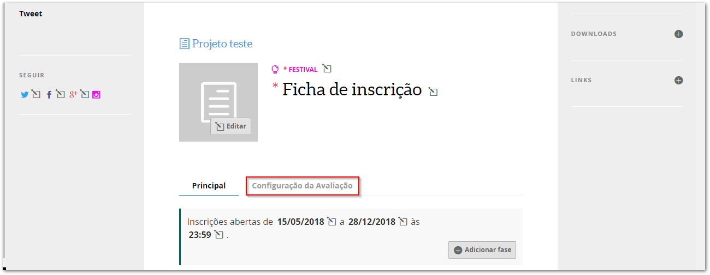
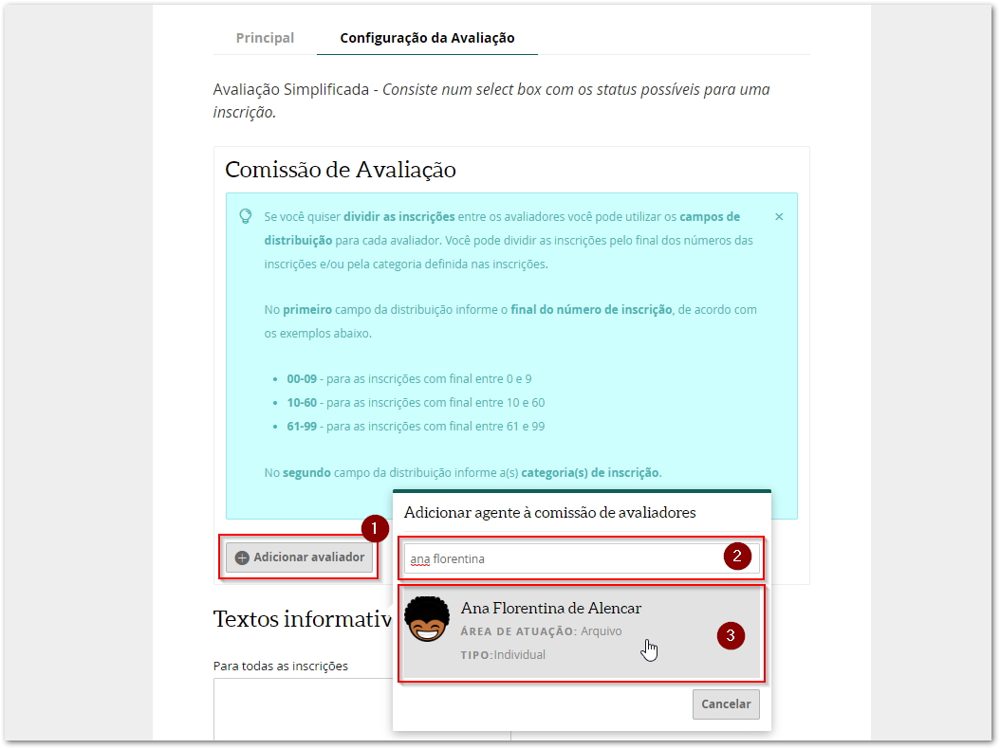
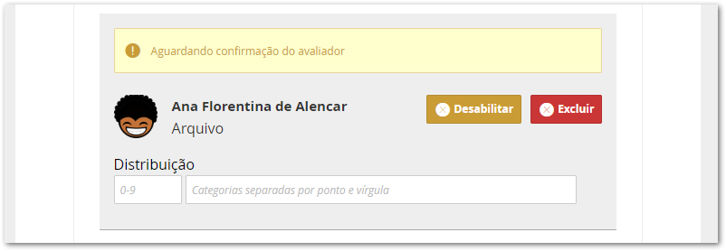
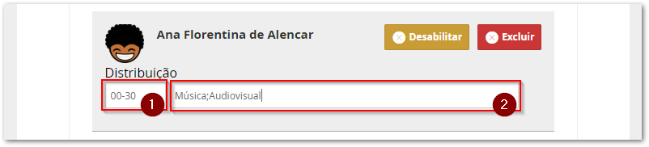

# Como configurar a comissão de avaliação

Antes de formar a comissão de avaliação é precisa checar se todos os avaliadores possuem perfil no Mapa Cultural do Ceará ou nos mapas parceiros \(Fortaleza, Guaramiranga, Juazeiro do Norte e Sobral\).

Peça aos avaliadores que informem o nome do agente cadastrado \(número 1 da imagem\).

> Existem alguns casos em que o mesmo avaliador possui mais de um perfil cadastrado no mapa, neste caso solicite o link do agente \(número 2\) para que se consiga encontrar o  correto.

O próximo passo é entrar na oportunidade criada, no modo de edição, e clicar na aba `Configuração da Avaliação`.

### Como adicionar os avaliadores

Agora, basta clicar no botão `Adicionar avaliador` , depois escrever o nome do agente cadastrado no Mapa Cultural e clicar em cima do perfil dele. 

> **Atenção:** você não deve inserir como avaliador os agentes que administram a oportunidade.

Um quadro amarelo ficará ativo até o avaliador confirmar o solicitação enviada por você.

Você pode adicionar quantos avaliadores quiser, basta repetir esses passos.

### Como distribuir as inscrições entre os avaliadores

Você pode dividir as inscrições pelo final dos números das inscrições e/ou pela categoria definida nas inscrições.

No primeiro campo da distribuição, informe o final do número de inscrição. No exemplo foram destinadas para a avaliadora as inscrições com final entre 00 e 30.

No segundo campo da distribuição, informe a\(s\) categoria\(s\) de inscrição \(essa é a pergunta condicional criada no questionário\). No exemplo foram destinadas as inscrições das categorias Música e Audiovisual.

Neste caso, a Ana Florentina de Alencar irá avaliar as inscrições com final entre 00 e 30 das categorias Música e Audiovisual.

### Desabilitar ou excluir um avaliador?

**Desabilitar** um avaliador significa que ele perderá o acesso às inscrições, mas as avaliações realizadas serão mantidas.

**Excluir** significa que as avaliações realizadas serão apagadas e o avaliador também perde acesso a às inscrições.

