# Como criar uma oportunidade

A oportunidade é uma ferramenta de inscrição e avaliação dentro do Mapa Cultural. Ela pode ser utilizada no processo de inscrição dos editais, mas também pode servir para uma banda de música abrir seleção para um novo membro e um espaço ou evento fazer uma chamada para compor a sua programação. Desse modo, a oportunidade pode estar vinculada a um projeto, agente, espaço ou evento.

A seguir, vamos detalhar o passo a passo no formato de texto, mas se preferir, temos a versão em vídeo 🤓 















### Criando uma oportunidade

Simularemos a criação de um edital abrindo uma oportunidade a partir de um projeto \(caso você não sabia como criar um projeto, clique aqui\). O mesmo modelo pode ser utilizado para criar uma oportunidade vinculada ao agente, espaço ou evento. 

Primeiro, acesse a projeto que você criou a partir do seu painel de controle. 

1. Clique no seu perfil;
2. Clique em `Meus Projetos`;
3. Entre \( \) está indicado a quantidade de projetos cadastrados, neste caso, o projeto utilizado ainda está como rascunho;
4. Clique em `editar` abaixo do nome do projeto.

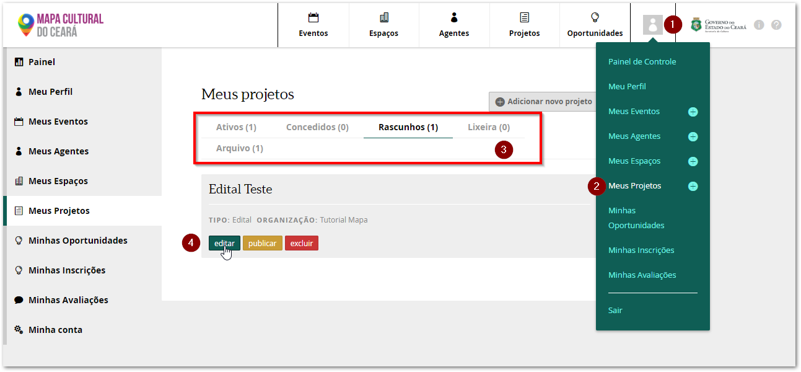

Dentro do projeto, clique na aba `Oportunidade`, depois em `Criar Oportunidade` e selecione o método de avaliação.

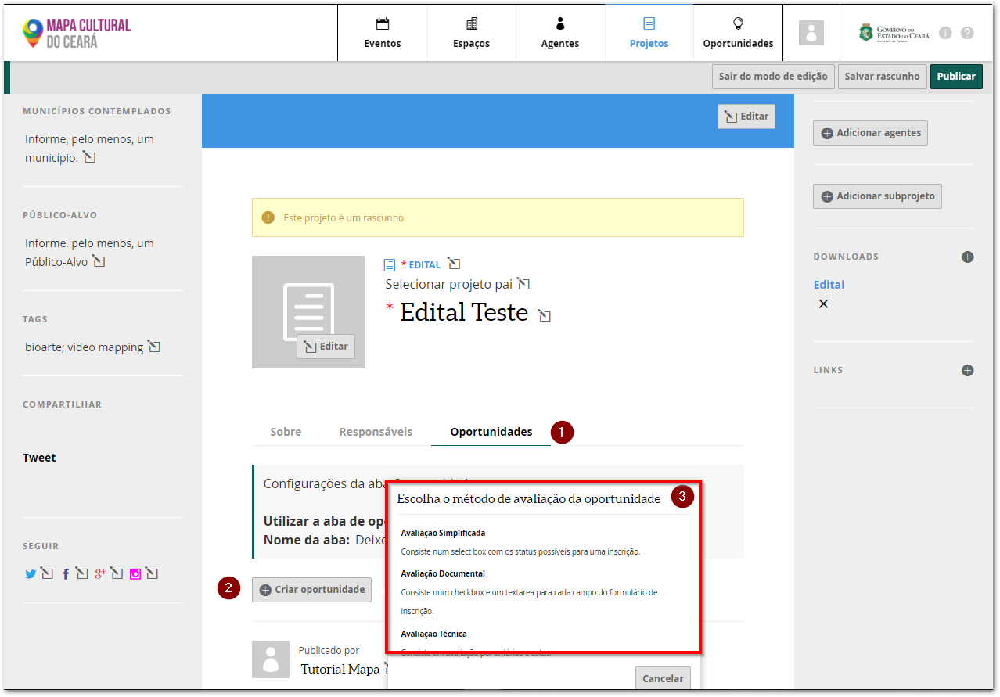

#### Tipos de avaliação

* Avaliação simplificada: consiste numa caixa de seleção onde o avaliador indicará se a inscrição é selecionada, suplente, não selecionada e inválida; ele também pode adicionar uma justificativa.
* Avaliação documental: cada pergunta pode ser avaliada separadamente indicando se a mesma está válida ou inválida; é possível incluir uma observação / justificativa e indicar o item que foi descumprido no caso de invalidação.
* Avaliação técnica: consiste em avaliação por critérios e notas; é obrigatório preencher todas as notas e incluir uma justificativa. 


A avaliação técnica é a única que precisa ser configurada, incluindo as categorias, critérios e informando a nota máxima, mínima e peso de cada critério.


### Configurando a oportunidade

Após selecionar o tipo de avaliação você será direcionado para a página de configuração da oportunidade. As informações mínimas que o sistema solicita para salvar uma oportunidade são:

1. Categoria da oportunidade \(se é uma edital, seleção, chamada...\);
2. Nome da oportunidade;
3. Período de inscrição;
4. Texto introdutório. 


O sistema abre e fecha automaticamente a inscrição, de acordo com as configurações da data de abertura  e encerramento e horário de encerramento.


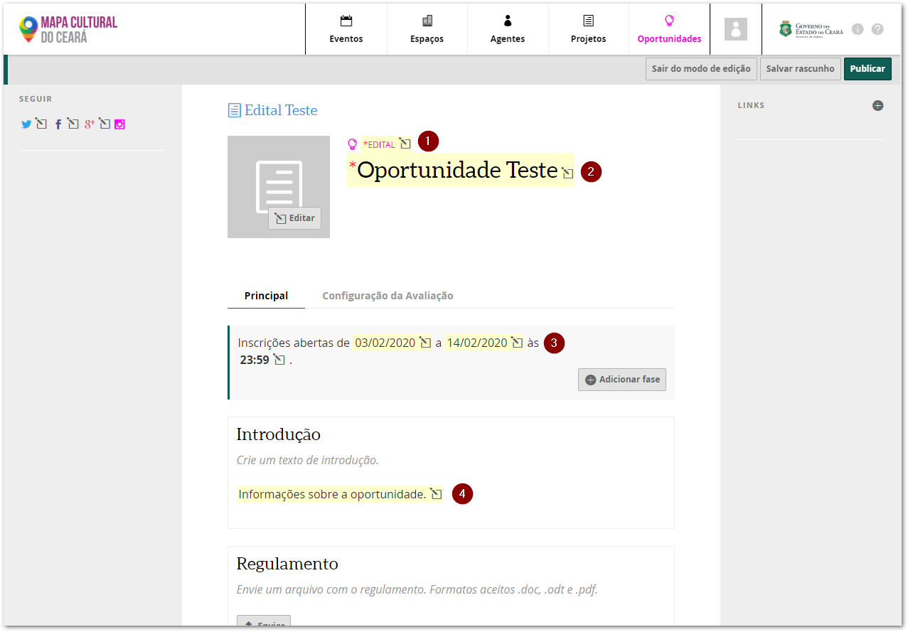

Você também poderá inserir:

1. TAGS: inserir palavras chaves sobre a sua oportunidade que poderão ser utilizas no campo de busca;
2. ADMINISTRADORES: permite adicionar outros agentes cadastrados no mapas como administradores da oportunidade;
3. DOWNLOADS: local para inserir documentos como currículo, Clipping de mídia...;
4. LINKS: local para inserir links.

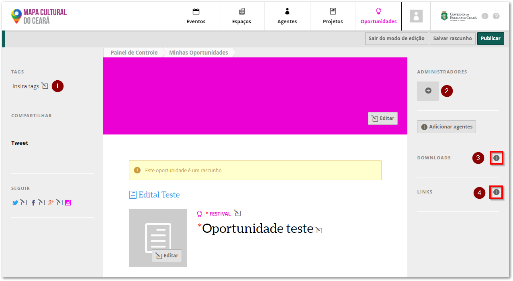


Recomenda-se que salve a oportunidade como rascunho enquanto estiver fazendo a sua configuração e criando a ficha de inscrição.


### Preenchendo a ficha de inscrição

#### Tipos de agentes que devem ser vinculados à ficha de inscrição e restrições na inscrição

Rolando a tela para baixo você encontrará a seção de configuração dos agentes que poderão ser inseridos na ficha de inscrição. 

Toda a inscrição deve ser iniciada por um agente individual responsável, mas é possível que a inscrição seja feita em nome de um agente coletivo, com ou sem CNPJ. Nesses casos, é preciso definir se irá utilizar esse campos de forma opcional ou obrigatória.

Nessa seção também é possível definir um numero máximo de vagas, por exemplo, uma oficina com limite de vagas ou definir o número máximo de inscrições por agente responsável.


É preciso atenção ao definir o número máximo de inscrições por agente responsável pois nem sempre ele é o proponente da inscrição no edital. No caso da inscrição ser por uma instituição ela será o proponente e esta opção não limitaria esses casos.


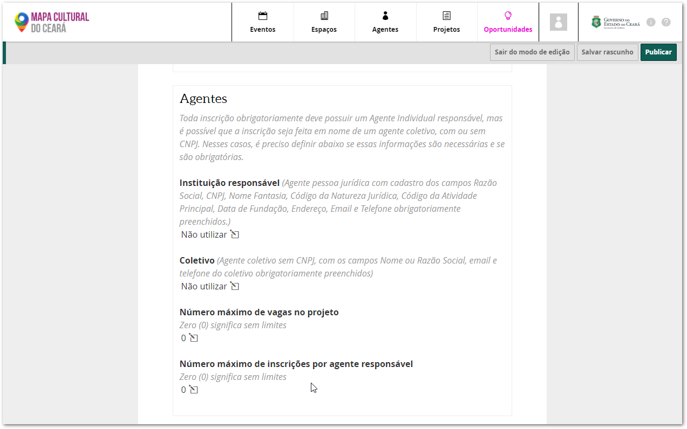

#### Pergunta condicional

Esse segundo bloco permite configurar a pergunta condicional. A resposta à essa pergunta pode ser utilizada para personalizar as demais perguntas. Ou seja, dependendo da opção selecionada você pode apresentar para o usuário diferentes tipos de perguntas.

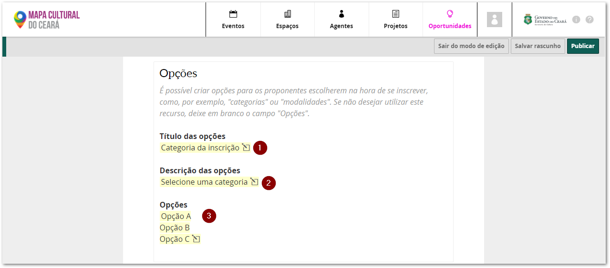

#### Adição de campos e título do projeto

O próximo bloco possibilita a inclusão dos campos de pergunta, temos as seguintes opções: 

1. Um campo padrão para inserir o nome do projeto você pode selecioná-lo como obrigatório ou opcional.
2. Botão para inserir campos onde a resposta é um informação preenchida pelo usuário.
3. Botão para inserir campos onde a resposta é um anexo que deva ser enviado.

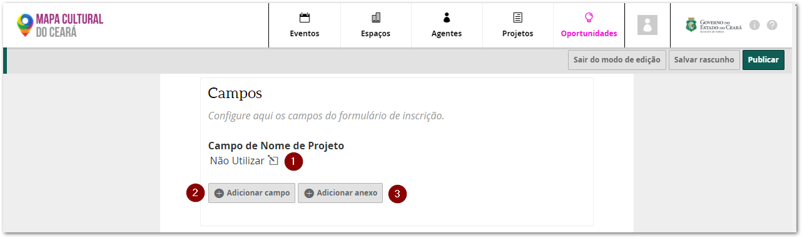

Abaixo o exemplo da criação de um campo do tipo seleção única, o mesmo procedimento é utilizado para a criação dos outros campos.

1. Selecionar o tipo de campo;
2. Nome do campo;
3. Descrição;
4. Opções de escolha;
5. Informar se a pergunta é de preenchimento obrigatório;
6. Selecionar em quais respostas da pergunta condicional ela deve aparecer.

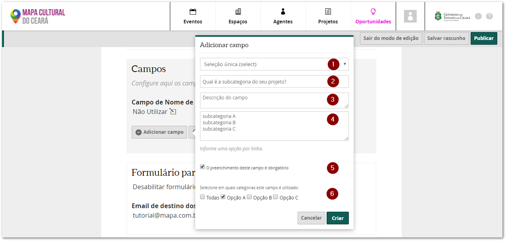


Tipos de pergunta possíveis:

* CNPJ: valida se o número inserido é um CNPJ;
* CPF : valida se o número inserido é um CPF;
* URL \(link\) : valida se a informação inserida é um site;
* Data: apresenta um calendário para seleção de uma data;
* E-mail: valida se a informação inserida é um e-mail;
* Texto \(textarea\): campo de texto com uma área ampliada para digitação \(possui opção de delimitar a quantidade de caracteres\) 
* Texto simples: campo de texto com uma área reduzida para digitação \(possui opção de delimitar a quantidade de caracteres\)
* Numérico: só permite que sejam inseridos números na resposta;
* Seleção múltipla: permite selecionar vários itens de uma lista;
* Seleção única:  permite selecionar somente um item de uma lista;
* Título de Seleção: é apenas uma seção para organizar o formulário, não é uma pergunta.


O campo de anexo é bastante semelhante. Você vai:

1. Clicar no botão adicionar anexo;
2. Informar nome do campo;
3. Descrição;
4. Informar se a pergunta é de preenchimento obrigatório;
5. Selecionar em quais respostas da pergunta condicional ela deve aparecer.

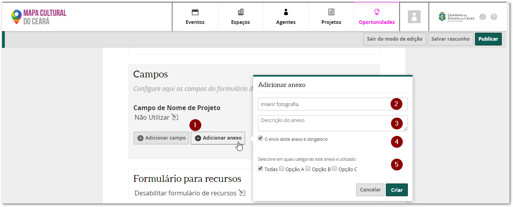


O campo de anexo permite o envio de um único arquivo com o tamanho máximo de 5 mb. 

[Neste link temos dicas de como reduzir o tamanho de pdf's e como juntar vários pdf's num único arquivo.](https://cultura-ceara.gitbook.io/dicas/)


#### Ordenar os campos

 Para ordenar as perguntas basta clicar e arrastar para cima ou para baixo.

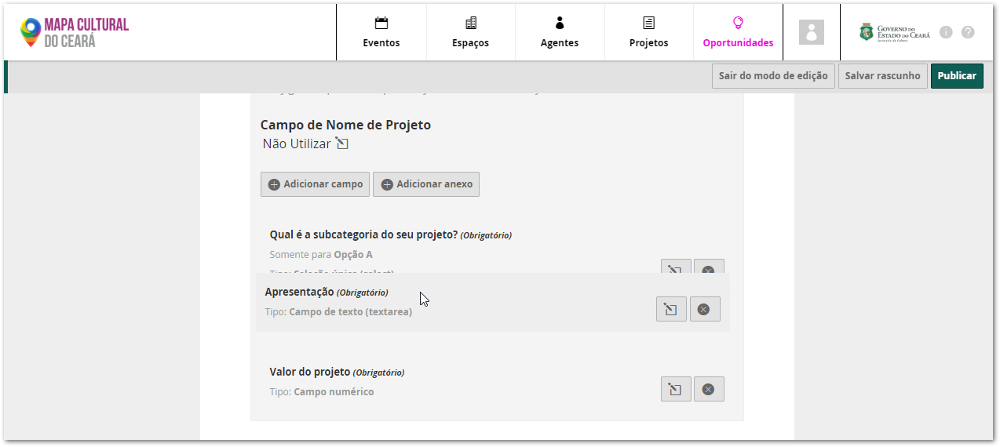

### Dicas de como criar uma ficha de inscrição


**Dica 1:** Não se deve solicitar na ficha de inscrição informações cadastrais que estão no perfil do agente como nome, data de nascimento, endereço... Essas informações são incluídas automaticamente na planilha dos inscritos. Como também deve-se evitar solicitar o currículo e e Clipping de mídia uma vez o perfil do agente também possui essa função.



**Dica 2:** Crie primeiro o questionário como um documento compartilhado, assim facilitará a sua revisão e ajuste. Somente quanto estiver pronto é que alimente no Mapa Cultural.



**Dica 3:** É possível copiar o questionário de uma oportunidade para outra. 

Para isso, vá para a oportunidade que você já criou e role até o final da tela. Clique na seção `Importar / Exportar o formulário` e depois no botão `Exportar Formulário` \(número 1 da imagem abaixo\). Um arquivo com o questionário será salvo na seu computador. 

Depois abra a nova oportunidade vá para a seção `Importar / Exportar o formulário` e depois no botão `Escolher arquivo` \(número 2\). Seleciona o arquivo salvo e clique no botão `Enviar Campos`.


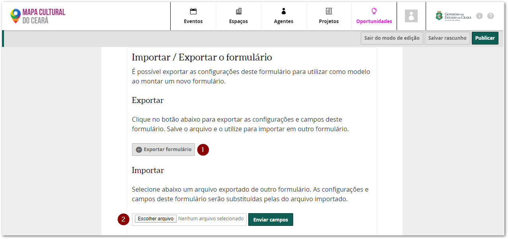

### Testando a ficha de inscrição

É fundamental faça a simulação do preenchimento do questionário pois depois que houver a primeira inscrição no questionário não será mais possível alterar as perguntas. Por vezes quem faz o preenchimento da ficha fica viciado no questionário e alguns erros passam despercebidos, por isso é recomendado que uma segunda pessoa também faça essa simulação.


Somente os administradores do Mapa Cultural conseguem fazer alterações no formulário depois que uma primeiro questionário for iniciado.


Durante a simulação do preenchimento é importante:

* [ ] Testar o formulário com todas as categorias disponíveis, se tiver usando a pergunta condicional;
* [ ] Preencher os campos e observar se está correto o tipo da pergunta;
* [ ] Verificar se as perguntas de múltipla e única resposta estão com as opções preenchidas;
* [ ] Observar se as perguntas obrigatórias estão configuradas como tal;

O botão para testar o questionário está no final da página e se chama `Pré-visualizar ficha de inscrição.`

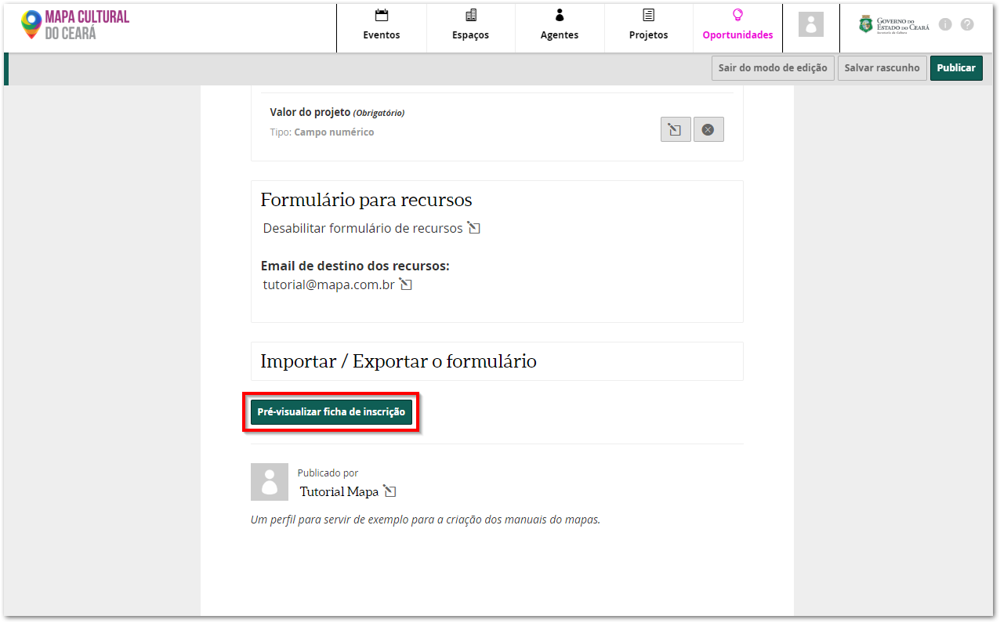

### Configurando a avaliação técnica

O único método de avaliação que precisa ser configurado é o da avaliação técnica. Para isso, basta acessar a aba `Configuração da Avaliação`. Você encontrará duas áreas, para configurar a comissão de avaliação \([ver ajuda de como adicionar a comissão](https://cultura-ceara.gitbook.io/tutorial-para-o-usuario-do-mapa-cultural/oportunidades/como-adicionar-a-comissao-de-avaliacao)\) e para configurar os critérios.

Os critérios são organizados em seções. Crie primeiro a seção clicando no botão `Adicionar seção de avaliação técnica`.

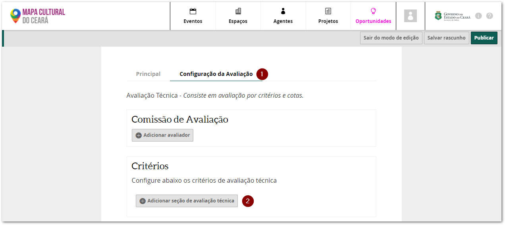

No exemplo abaixo criamos a seção Critérios de Mérito Cultural e dentro dela configuramos os critérios "clareza e consistência" e "contribuição para formação de novos agentes culturais" com seus respectivos intervalos de pontuação e peso. Na imagem abaixo destacamos:

1. Local para preencher o título da seção;
2. Local para preencher e configurar os critérios de avaliação, indicando valor máximo, mínimo e peso para o critério;
3. Controles para incluir ou excluir os critérios.

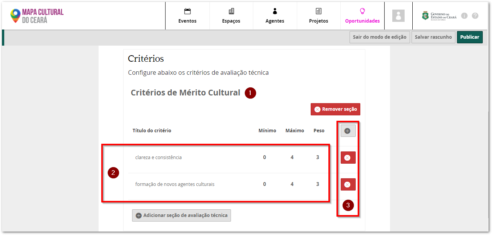


Os mesmos critérios são utilizados para avaliar todos os projetos da oportunidade, caso existam critérios de avaliação específicos por categoria recomenda-se a criação de uma oportunidade por categoria.


### Divulgado o link da inscrição

Antes de divulgar o link da inscrição é importante verificar três pontos:

* [ ] Se a oportunidade está assinada pelo agente correto;
* [ ] Se a oportunidade está publicada;
* [ ] Se você pegou o link fora do modo de edição.

Como foi você criou a oportunidade, a assinatura no final da página deve estar com o seu agente. No nosso exemplo, por ser um edital, a assinatura deve ser da coordenação responsável. Neste caso, basta clicar na assinatura e selecionar o agente correto.

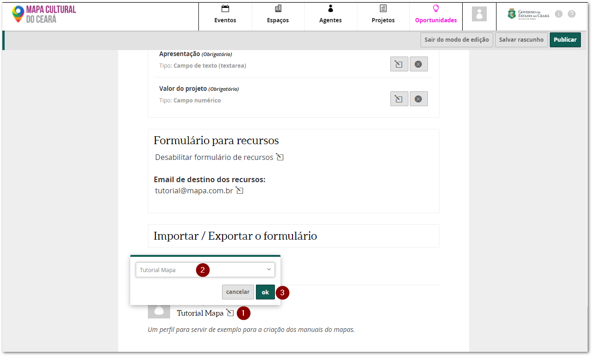


Você só consegue transferir a propriedade para um agende que você seja proprietário ou um administrador.


Quando estiver tudo configurado, publique a oportunidade. Lembrando que ela só estará aberta para a inscrição quando a data de início for atingida. 

E lembre-se de `Sair do modo de edição` para pegar o link da oportunidade. 

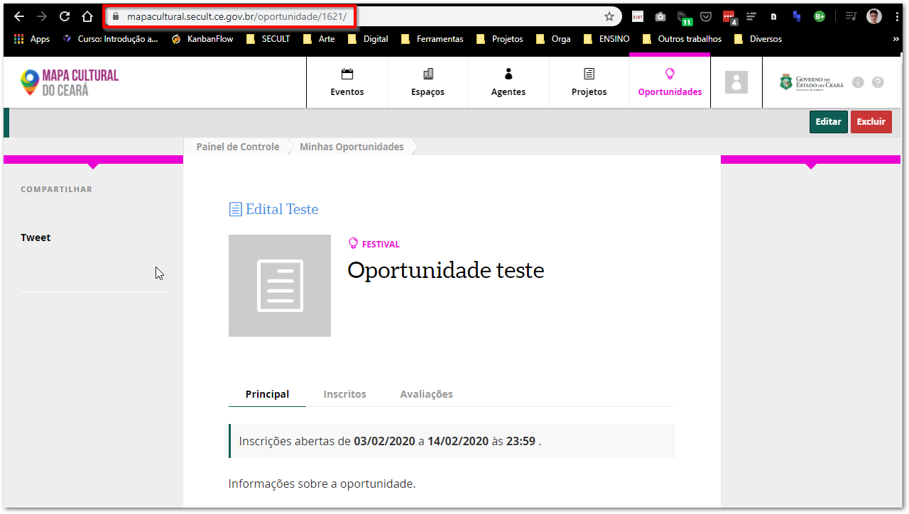

Na imagem abaixo o link correto: https://mapacultural.secult.ce.gov.br/oportunidade/1621/

E esse seria o  link errado, do modo de edição \(veja que o nome oportunidade está no plural e depois existe a palavra edita\): https://mapacultural.secult.ce.gov.br/oportunidade**s/edita**/1621/

