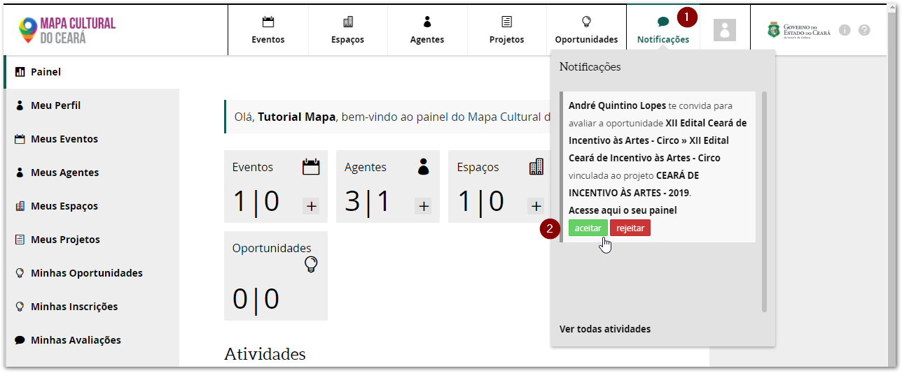
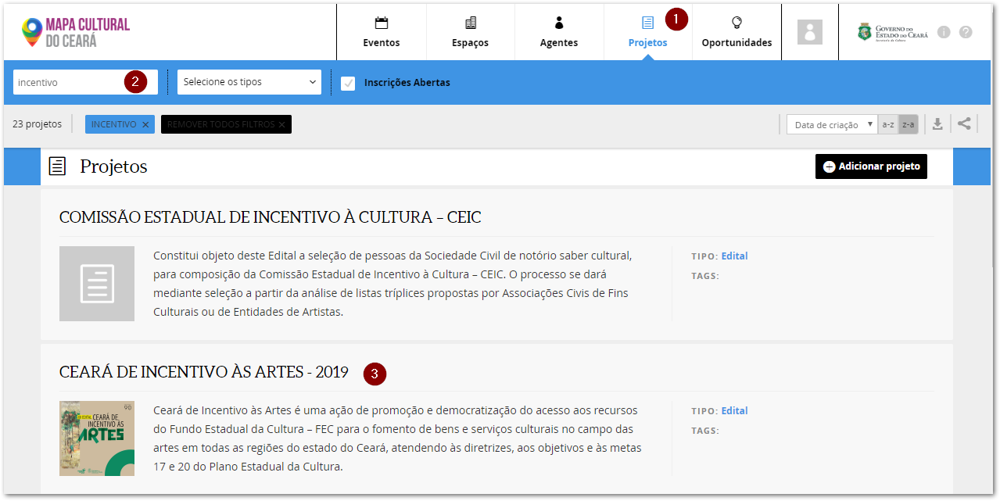
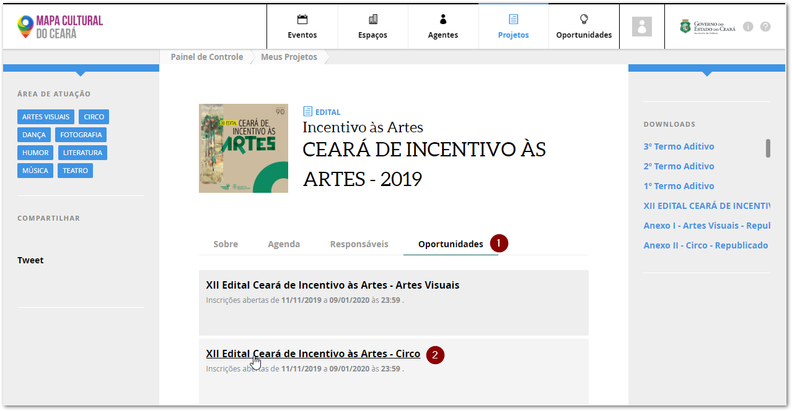
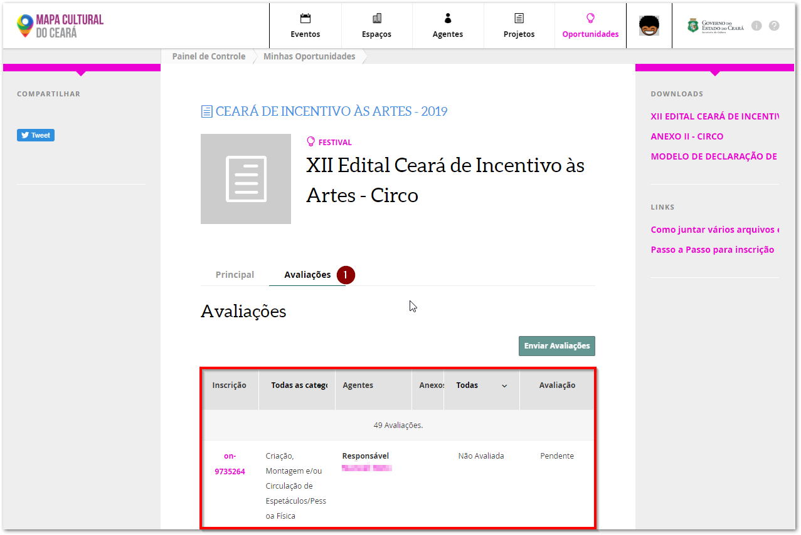
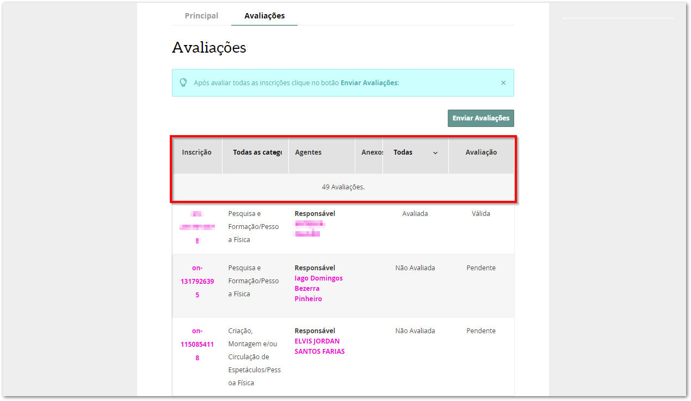
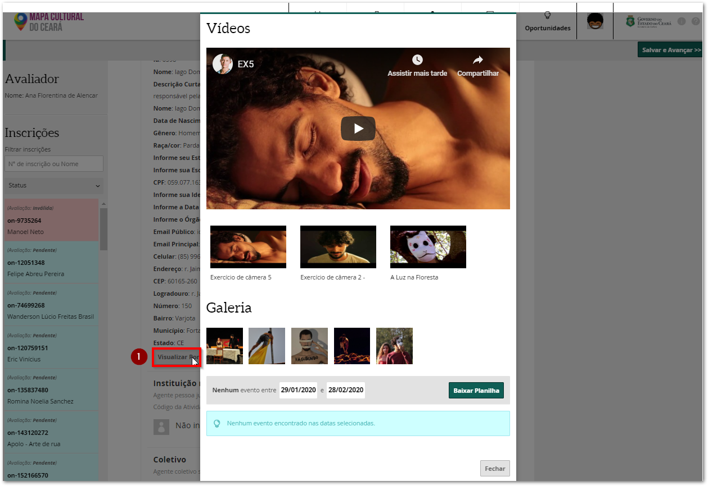
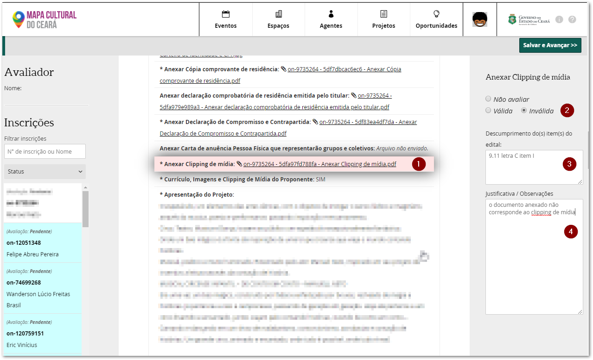
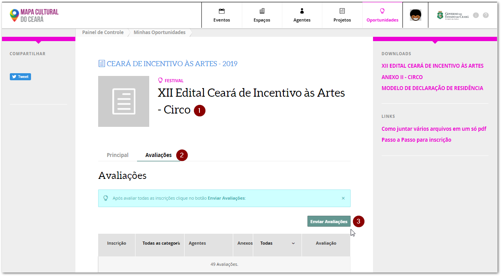
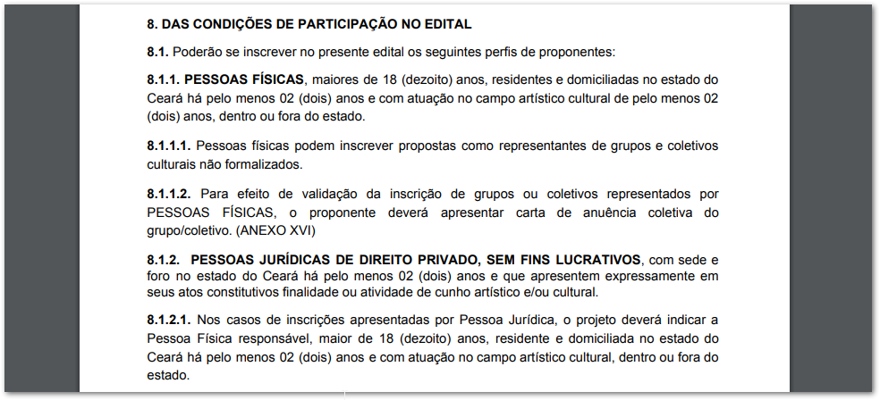
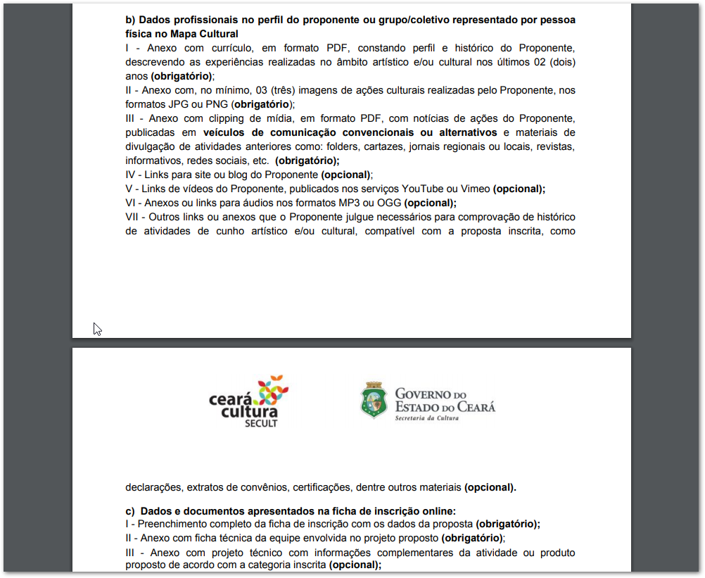

# Como fazer a avaliação documental

### Requisito para avaliar e o aceite do convite

É preciso estar cadastrado no Mapa Cultural do Ceará para fazer uma avaliação. Caso não tenha cadastro veja a seção sobre [como fazer o seu cadastro no Mapa Cultural](https://mapas.gitbook.io/tutorial-para-o-usuario-do-mapa-cultural/primeiros-passos/como-fazer-o-seu-cadastro-no-mapa-cultural).

Você precisa informar ao coordenador do edital o nome do agente cadastrado \(número 1 da imagem\) ou o link do agente \(número 2\).

Quando o coordenador te adicionar como avaliador, você receberá uma notificação. Ela aparecerá no menu principal, basta clicar no botão `Notificações` e, em seguida, em `aceitar`.

### Como encontrar a oportunidade que irá avaliar

O coordenador do projeto provavelmente lhe enviará o link para acessar o edital e as projetos que serão avaliados. Caso isso não ocorra, você pode encontra-ló a partir do menu `projetos`. 

Escreva o nome do edital no campo de busca. Como exemplo, avaliaremos o **XII Edital Ceará de Incentivo às Artes** na categoria **Circo**. Depois, basta clicar no nome do edital.

Dentro do edital, clique na aba `Oportunidades` e selecione a categoria específica. 

Como você aceitou o convite, aparecerá uma aba `Avaliações`. Clique nela e você verá uma tabela com todas as inscrições que precisa avaliar.

### Visualizando a inscrição e fazendo a avaliação

A tabela dos inscritos possui seis colunas com as seguintes informações:

* `Inscrição`:  apresenta o número de inscrição e o link para entrar na ficha; 
* `Todas as categorias`: apresenta a categoria selecionada na ficha de inscrição. É possível clicar no cabeçalho e selecionar a categoria;
* `Agentes`: apresenta o nome do agente responsável pela inscrição e o link para entrar no perfil;
* `Anexos`: link para baixar os anexos enviados na inscrição;
* `Todas`: apresentar o status da avaliação \(pendente, avaliada, enviada\). É possível clicar no cabeçalho e selecionar um status;
* `Avaliação`: apresenta o resultado da avaliação \(pendente, válida, inválida\).

No exemplo abaixo temos 49 projetos a serem avaliados sendo que só foi avaliado o primeiro projeto da lista que foi validado. 

Para ter acesso a ficha basta clicar no número da inscrição. No exemplo abaixo clicamos na inscrição on-9735264. A tela com a ficha de inscrição possui três partes:

1. Apresenta a lista com os projetos a serem avaliados. Nela é possível identificar as inscrições que ainda estão pendentes de avaliação e se a mesma foi validada ou invalidada. Também possui um campo busca.
2. Apresenta a ficha de inscrição.
3. Apresenta os campos da habilitação.


O campo de habilitação só aparece depois que um campo do questionário for clicado. Na imagem abaixo foi selecionado o campo da categoria. Além dele, também é possível selecionar o perfil do agente responsável pela inscrição, a instituição responsável ou o coletivo e todas as perguntas do questionário.


Descendo na parte do central você encontrará o perfil do Agente Responsável e, dependendo do tipo da inscrição, o perfil da Instituição Responsável \(grupo formalizado com CNPJ\) ou do Coletivo \(grupo informal\). Este campo possui os dados profissionais que devem ser inseridos no perfil do proponente como: currículo, fotos e clipping de mídia \(ver no edital os itens exigidos\). Para ver as fotos, vídeos, documentos e eventos cadastradas no perfil, basta clicar no botão`Visualizar Portfólio`.

Na imagem abaixo foi avaliado o anexo do clipping de mídia. Neste caso o campo foi considerado inválido, pois descumpriu o item 9.11 letra C item I do edital devido ao arquivo anexado não corresponder ao clipping de mídia.  Como se pode ver existem campos específicos para indicar o item de descumprimento e justificativa / observações.

Você deve avaliar todos os itens solicitados no edital incluindo os campos em anexo. Feito isso, basta clicar no botão `Salvar e Avançar`.


Nota: é possível fazer alterações na avaliação após clicar no botão de `Salvar e Avançar`. Basta clicar novamente no número de inscrição que foi avaliado.


### Finalizando a avaliação

Você pode retornar para a tabela com todas as inscrições clicando no nome da fase e em seguida na aba `Avaliações`.

O botão `Enviar Avaliações` fica ativo somente quando todos os projetos são avaliados. Ao clicar neste botão **não é mais possível** alterar qualquer avaliação. Então só se deve clicar neste botão após a reunião de alinhamento que será proposta pelo coordenador do projeto.
 

### Considerações sobre a habilitação

O edital apresenta os critérios a serem avaliados, normalmente estes item estão no seções que falam sobre as condições de participação do edital e sobre as informações exigidas para a validação da inscrição. No caso do [XII Edital Ceará de Incentivo às Artes ](https://mapacultural.secult.ce.gov.br/files/opportunity/1563/xii_edital_ceara_de_incentivo_as_artes.pdf)os itens 8 e 9.11. e seus subitens.


Em alguns editais, existem campos que devem ser avaliados dependendo da categoria escolhida pelo proponente. 


Conheça mais informações sobre[ o projeto do Mapa Cultural do Ceará](https://cultura-ceara.gitbook.io/tutorial-para-o-usuario-do-mapa-cultural/primeiros-passos/sobre-o-mapa-cultural-do-ceara) e boa avaliação!

