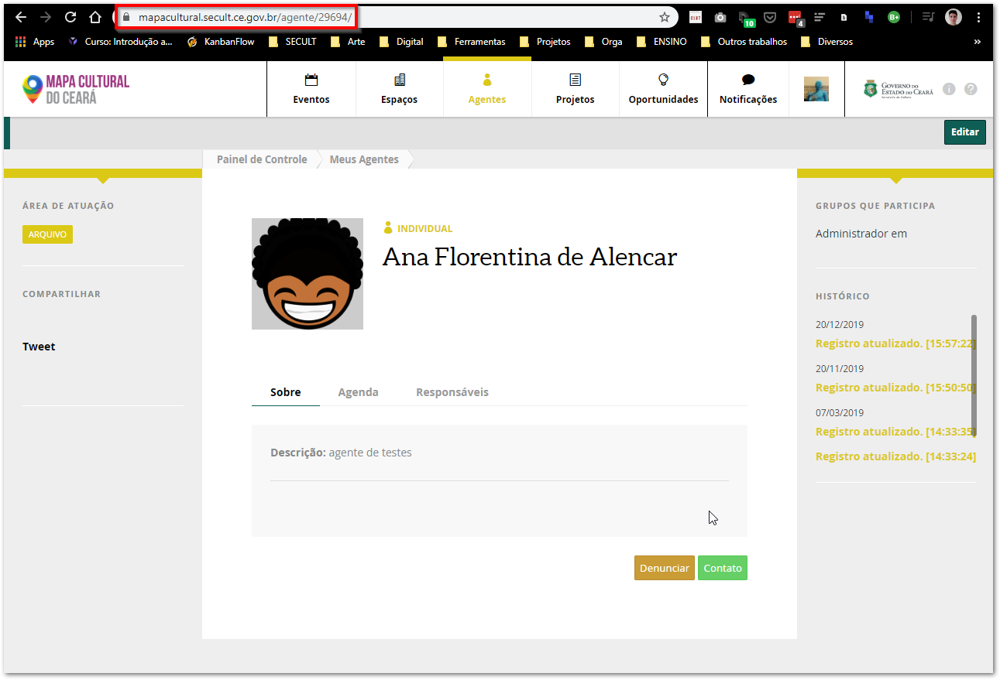

# Como faço para sair do Mapas?

Você deverá enviar um e-mail para **mapa@secult.ce.gov.br** com as seguintes informações.


Você deve enviar a mensagem utilizando a mesma conta de e-mail cadastrada no Mapa Cultural.



Caso você não lembre o e-mail ou não tenha mais acesso ao mesmo, você pode anexar um documento de identificação como RG ou Carteira de Motorista para comprovar a titularidade da conta.


**Título:** Exclusão de conta no Mapa Cultural do Ceará

**Corpo do e-mail:** Solicito a exclusão do agente \(inserir o link do agente cadastrado\). Em anexo meu documento de identificação.

A equipe de suporte receberá o chamado e comunicará por e-mail assim que for realizada a exclusão.

