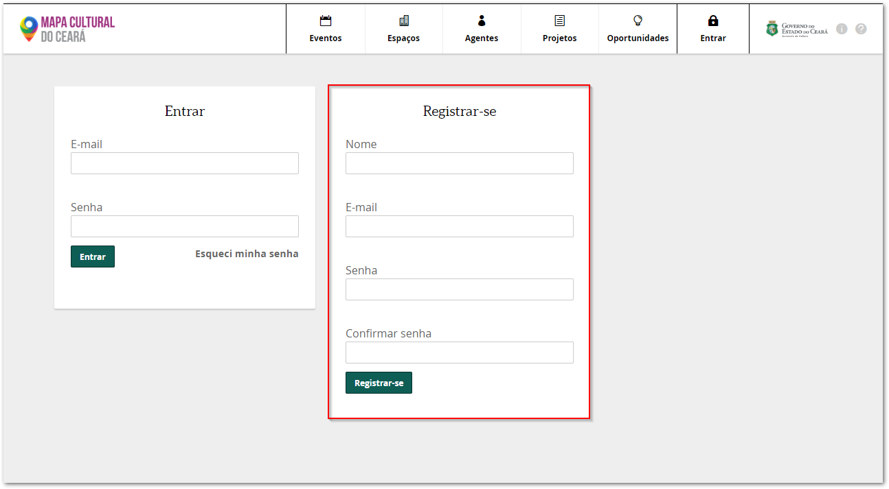
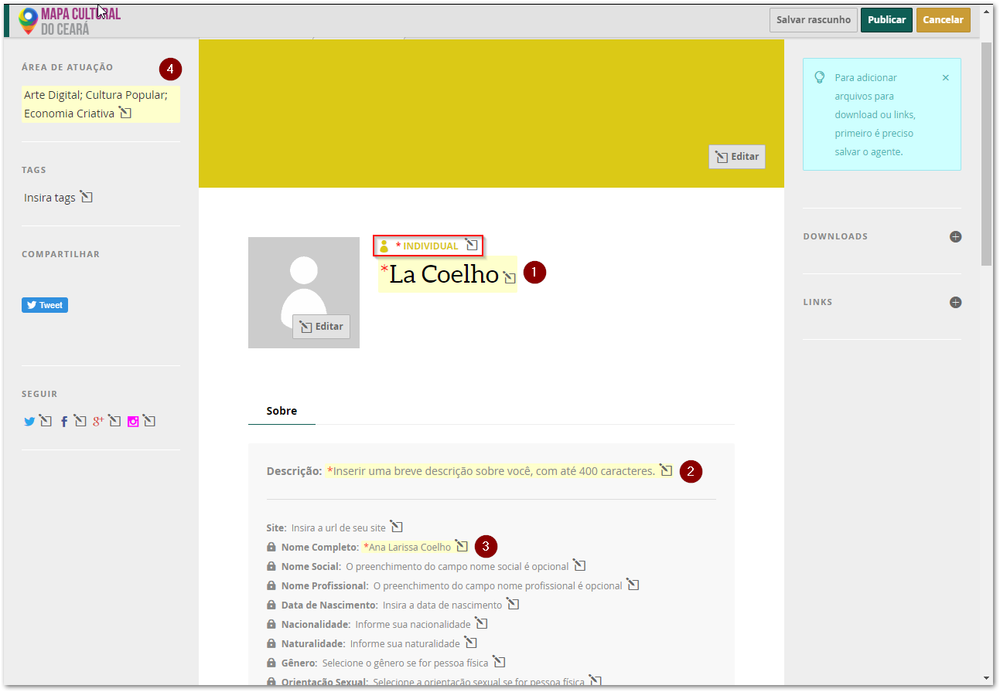
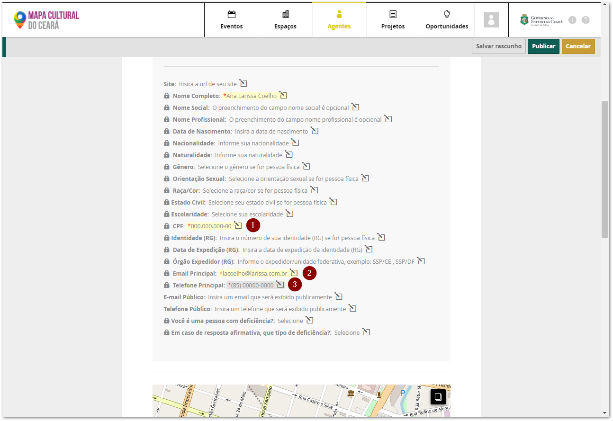
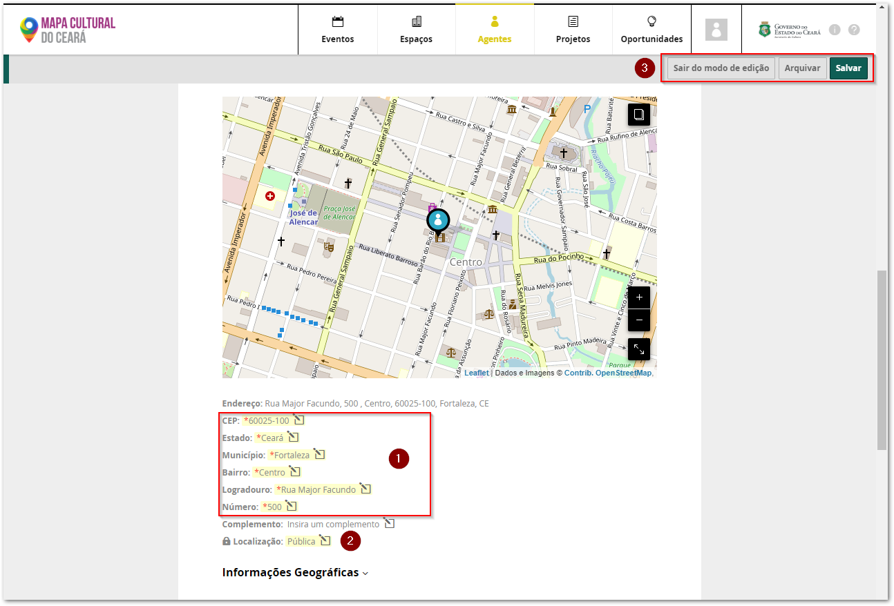
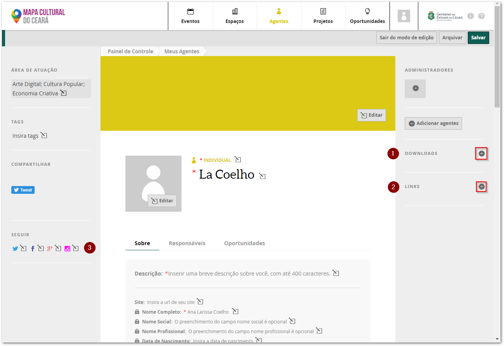
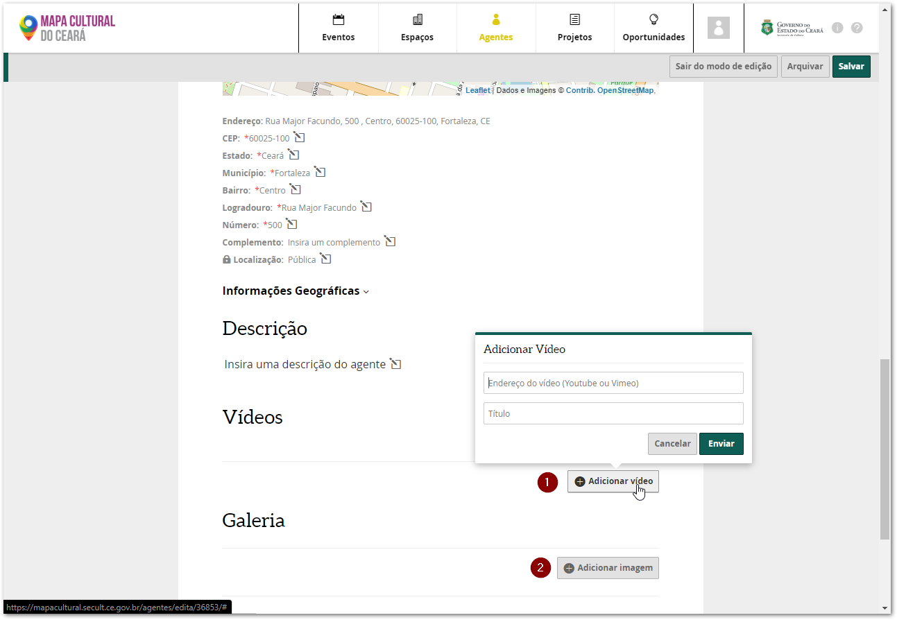

# Como fazer o seu cadastro no Mapa Cultural

### Iniciar o cadastro

Aqui está o[ link para você criar seu cadastro no Mapa Cultural do Ceará](https://mapacultural.secult.ce.gov.br/autenticacao/).
 Para se cadastrar preencha os campos com o seu nome, e-mail, crie uma senha com no mínimo 6 caracteres, confirme a senha e clique no botão `Registrar-se`.



Pronto! Você já está cadastrado na plataforma Mapa Cultural do Ceará. Agora, vamos terminar de preencher o perfil do seu agente cultural individual.

### Preencher os dados cadastrais obrigatório no perfil

Você deve ser direcionado para a página de edição do seu perfil. Vamos seguir o nosso passo a passo utilizando como exemplo a Ana Larissa Coelho. O Cadastro Individual é bem simples. Logo acima do seu nome social \(o nome como você gosta de ser chamado e como será encontrado na plataforma do Mapa Cultural\), deve aparecer a palavra “individual”. Isso que dizer basicamente que esse é um cadastro de uma pessoa física, com CPF. 


**ATENÇÃO**  você deve fazer **PRIMEIRO** seu cadastro na plataforma do Mapa Cultural como **Pessoa Física \(Agente Individual\)**. 


Neste primeiro caso vamos considerar o preenchimento com as informações mínimas solicitas pela plataforma. Preencha os seus dados cadastrais clicando no campo desejado, depois escreva ou selecione a informação correta e clique em enviar. Perceba que o campo ficará marcado de amarelo indicando que as informações ainda estão como rascunho.

Nesta primeira parte da tela os campos obrigatórios são:

1. Nome social
2. Descrição: escreva um texto curso sobre você com no máximo 400 caracteres
3. Nome completo
4. Área de atuação: é uma lista com opções definidas. A medida que você escreve aparecem as opções. Você pode escolher quantas áreas quiser.
 


Dica 1: utilize o campo de `TAGS` \(palavras chave\) caso você queria detalhar a sua área de atuação ou inserir uma área que não está listada. 



Dica 2: Caso pretenda participar de alguma chamada ou edital você também deverá preencher os campos desta lista.


Descendo um puco a tela você encontrará outros campos obrigatório, são eles:

1. CPF
2. E-mail principal
3. Telefone principal com o DDD

Por fim é preciso preencher as informações do endereço e clicar em `Salvar.`

1. Informações sobre o endereço de residência: CEP, Estado, Município, Bairro, Logradouro \(rua ou avenida\) e Número.
2. Localização: neste campo você informar se o seu endereço deve ficar como `Público` \(todos do mapas podem encontrar o seu endereço\) ou `Privado` \(somente você e as pessoas que criarem as oportunidade podem ter acesso ao seu endereço\)
3. Botão Salvar


Após clicar no botão de salvar, note que os campos não estão mais marcados de amarelo, indicando que suas informações foram salvas.


### Como adicionar documentos e links

Você também pode anexar dados profissionais ao seu perfil. Veja como fazer:

1. **Anexar histórico, currículo, release, clipping de mídia ou outros tipos de documentos** \(recomendado no formato PDF com tamanho máximo de 5MB\)**.**
    Para adicionar esses documentos clique no sinal de `+` ao lado da guia `DOWNLOADS`. Digite o título do documento, depois clique no botão `Escolher arquivo` e selecione, no seu computador, o documento desejado. Por fim, clique em `Enviar`. Agora você verá que o documento aparecerá automaticamente na seção `DOWNLOADS`.
2.  **Incluir links de áudio e outros sites.** Clique no sinal de `+` ao lado da guia `LINKS`, que está na lateral direita. Primeiro cole o endereço do link que você deseja incluir no perfil, depois digite o título que aparecerá e, por fim, clique no botão `Enviar`. Agora você verá que o link aparecerá automaticamente na seção `LINKS`.
3. **Incluir links das redes sociais.**
    No lado direito, você encontra a seção `SEGUIR` com o ícone das redes sociais Twitter, Facebook e Google +. Clicando em cada uma delas, você pode adicionar o endereço das suas redes sociais ao seu perfil do mapa.


Dica 3: fizemos [este manual com dicas de como juntar e compactar arquivos no formato PDF](https://cultura-ceara.gitbook.io/dicas/).


### Como adicionar imagens e vídeos

1. **Incluir vídeos.**
    Para inserir o vídeo desça até a seção Vídeos e clique no botão `Adicionar vídeo`. Você pode adicionar o link de um vídeo que está no [Youtube](https://youtube.com/) ou no [Vimeo](https://vimeo.com/pt-br/). Cole o link do vídeo no campo indicado, escreva um título e clique em `Enviar`. Feito isso, você verá que o vídeo será adicionado automaticamente na página do seu perfil.
2. **Incluir imagens** \(precisam  estar no formato JPG  ou PNG no tamanho máximo de 5MB\).
    Na seção galeria e clique no botão `Adicionar imagem`. Em seguida, informe o título da imagem, clique no botão `Escolher arquivo` e selecione, no seu computador, a imagem desejada. Por fim, clique em `Enviar`. Você verá que a imagem aparecerá automaticamente na seção galeria. Para  inserir mais imagens, repita a mesma operação.

### Campos obrigatórios para a inscrições no editais

Também será necessário preencher os seguintes campos para fazer a inscrição nos editais:

* Data de Nascimento
* Nacionalidade
* Naturalidade
* Gênero
* Raça/Cor
* Identidade \(RG\)
* Data de Expedição \(RG\)
* Órgão Expedidor \(RG\)

