# Como se inscrever nos editais

Bem-vindo ao passo a passo de como fazer a sua inscrição nos Editais da Secretaria da Cultura do Estado do Ceará.

A inscrição será realizada pelo Mapa Cultural do Ceará, uma plataforma livre, gratuita e colaborativa de mapeamento da Secretaria da Cultura do Estado sobre cenário cultural cearense. É necessário que você crie a sua página de agente cultural onde será apresentado o seu histórico de atuação profissional no campo artístico-cultural para a participar dos Editais. 

Vale lembrar para quem já têm cadastro no Mapa Cultural do Ceará e nos Mapas dos municípios de Juazeiro do Norte, Chorozinho, Sobral, Fortaleza e Guaramiranga não é preciso fazer novo cadastro para participar dos editais, bastando atualizar informações que julgue necessárias até a data de envio da inscrição.

Este passo a passo está disponível no formato de vídeo e em texto. Vamos começar!



### Fazer o seu cadastro no Mapa Cultural

Se você já possui castro no Mapa [siga para o próximo ponto](https://app.gitbook.com/@cultura-ceara/s/tutorial-para-o-usuario-do-mapa-cultural/~/drafts/-M3gQ1lBigpGCkdfTjCG/primeiros-passos/como-se-inscrever-nos-editais#h.xsum5wj02bui).

Se você não possui cadastro é preciso criar o seu perfil no Mapa. Clique no link abaixo para ver o passo a passo.



Se a sua inscrição é como a pessoa jurídica ou representando um coletivo é preciso criar este perfil a partir do seu cadastro inicial.




Você NÃO deve criar no Mapa uma conta específica, com e-mail e senha, para a pessoa jurídica ao coletivo. Estes perfis devem ser criados dentro da sua conta pessoa e sua administração pode ser compartilhada com outros usuários da plataforma.


### Buscar a página do Edital 

Cada um dos editais possui uma página específica no Mapa Cultural do Ceará para fazer a inscrição. Esta página é chamada de oportunidade. Você pode encontrar o link para o edital do seu interesse no [http://editais.cultura.ce.gov.br/](http://editais.cultura.ce.gov.br/)

Você também pode encontra as oportunidades na Plataforma no Mapa da Cultura \( [https://mapacultural.secult.ce.gov.br/](https://mapacultural.secult.ce.gov.br/) \), bastando clicar  no botão `Oportunidade` no menu superior. 

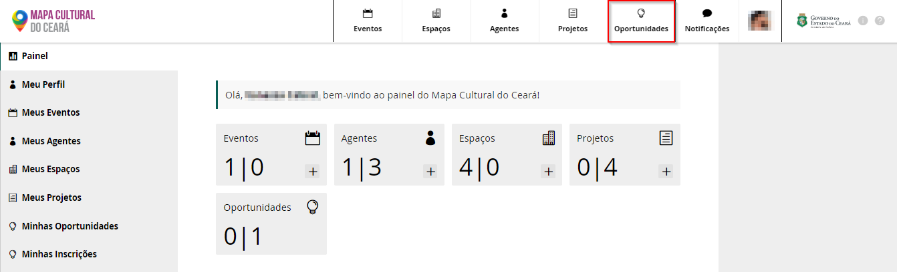

Marque a opção **inscrições abertas**, para ver as oportunidades que estão recebendo inscrições. 

Outra opção é digitar o nome do edital em **Buscar oportunidade**. 

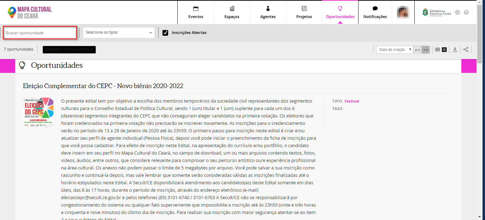

### Fazer a inscrição no Edital

Acessando a oportunidade aparecerá um campo para você digitar o nome do agente responsável pela inscrição. Aqui você terá que digitar o nome do seu **agente individual \(Pessoa Física\)**. Se tudo ocorreu bem com o seu cadastro, assim que você digitar, aparecerá o seu perfil. Então selecione o seu agente e depois clique no botão `Fazer inscrição`.

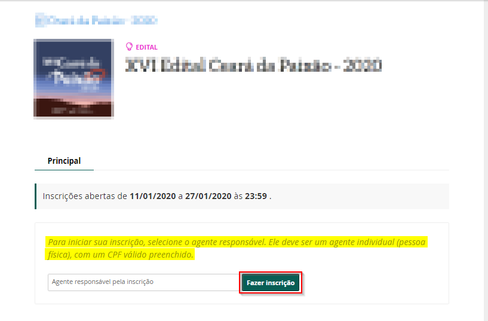

Você verá o **NÚMERO DE INSCRIÇÃO** da ficha de inscrição. Será a partir desse número que você acompanhará o andamento de sua inscrição.

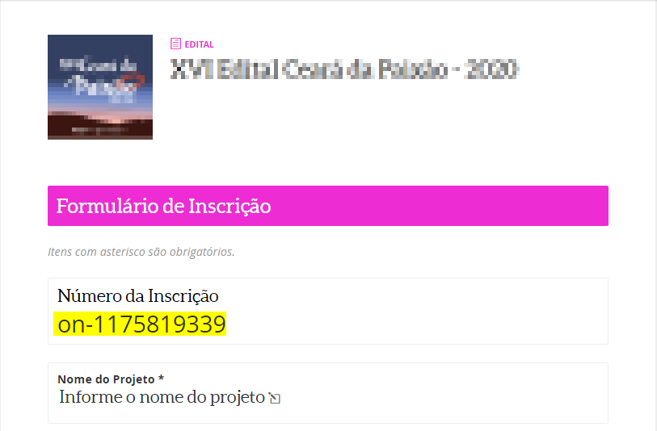

Para indicar a Pessoa Jurídica Proponente, clique no botão `adicionar` no campo **“Instituição responsável”**. 

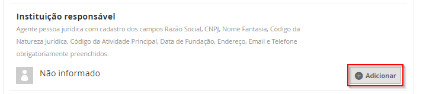

Clique no botão `adicionar` e digite no campo **"Selecionar Instituição responsável"** o nome da instituição pessoa jurídica proponente, que foi cadastrado como **Agente Coletivo**.

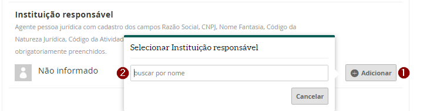

Selecione a instituição responsável clicando, para seguir com a inscrição.

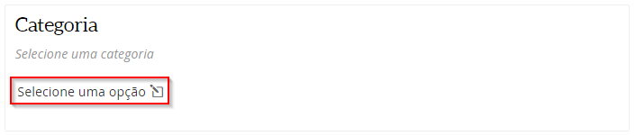

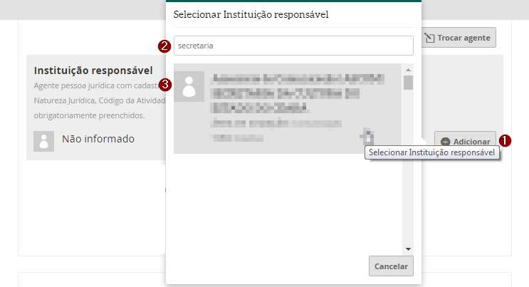

Para adicionar o Coletivo \(instituição SEM CNPJ\) basta seguir o mesmo procedimento no item Coletivo.

### Preencher os campos de informação e subir os arquivos anexos 

Em alguns editais é necessário escolher a **categoria** da sua inscrição. Normalmente é a primeira pergunta da ficha de inscrição e a sua resposta irá definir quais questões específicas você irá responder.

O que falta agora é preencher o questionário.  Existem alguns tipos de pergunta:


As perguntas que são obrigatórias, possuem um **\* \(asterisco\)** no título. 


_Pergunta para digitar um texto._ Clique no botão `Informe`, depois digite o texto na caixa que abrirá e clique no botão de `OK`

_Pergunta com uma lista de opções_. Primeiro clique no botão `Informe`, depois clique na seta para exibir as opções da lista. Selecione uma opção e clique no botão `OK`.

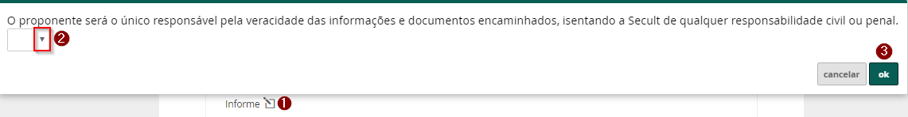

_Pergunta para inserir uma data._ Você deve iniciar selecionando o ano, depois o mês e por último marcar o dia e clicar no botão `ok`.

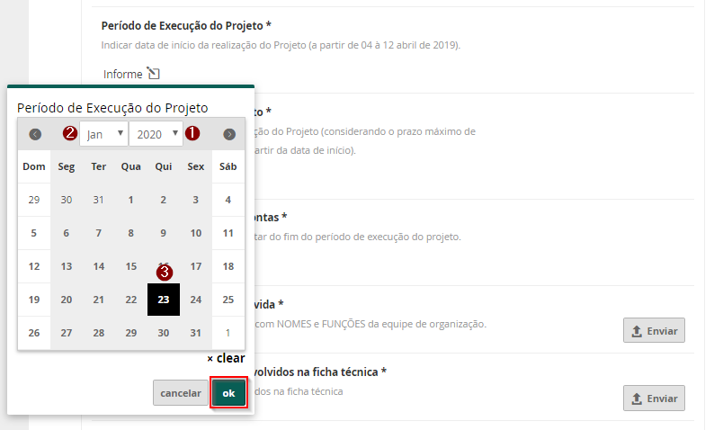

_Perguntas onde é preciso subir documentos que estão no seu computador._ Para isso, clique no botão `Enviar`, depois em `Escolher arquivo`. Para enviar o arquivo clique no botão `Enviar anexo` 

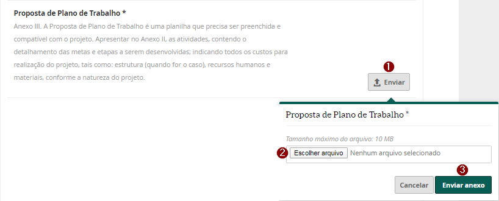

Se precisar substituir o arquivo, clique no botão`Editar`.

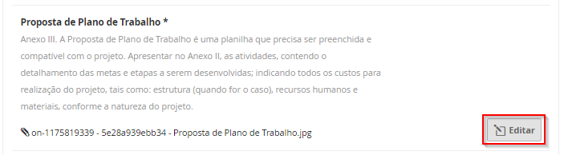


Para se certificar que você subiu o arquivo corretamente, basta clicar no link com o nome do arquivo anexado.


### Concluir a inscrição 

Você pode parar a sua inscrição a qualquer momento e continuá-la depois. Se você, por exemplo, não está seguro se tem os arquivos corretos, quer ler novamente o edital ou tiver qualquer outro inconveniente, você pode retomar a sua inscrição de onde parou clicando em seu perfil e, depois, em minhas inscrições.

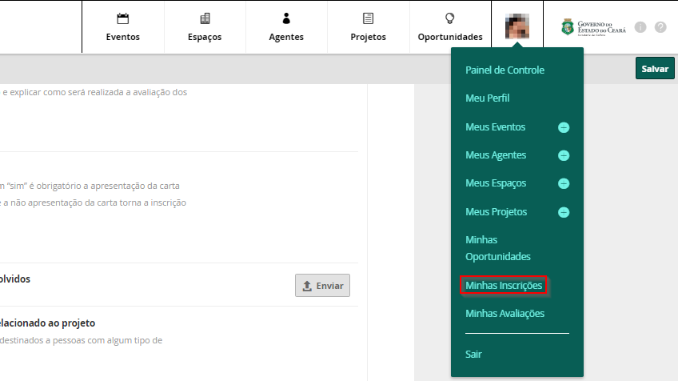

Lá estará a sua inscrição que foi iniciada na aba **Rascunho**. Bastando clicar na inscrição para retomá-la ou no botão `editar`.

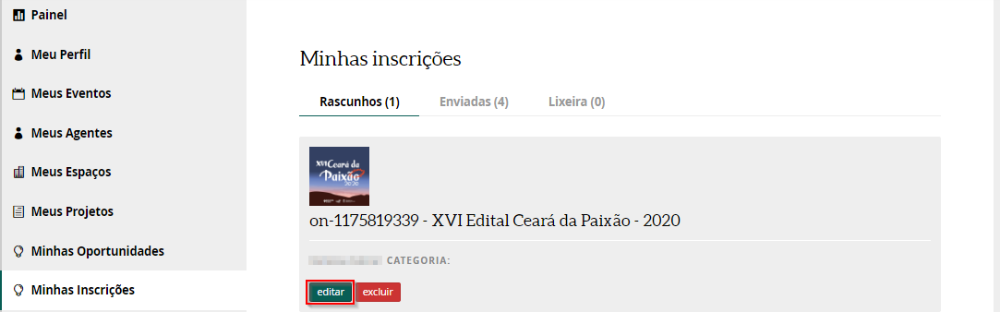

Após verificar as informações da sua inscrição e ver que tudo está correto, clique no botão `enviar inscrição`. 

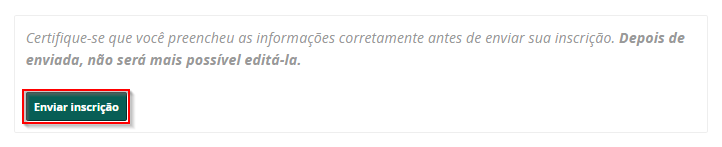


Atenção: essa ação é definitiva, certifique-se que todos os documentos e dados estão em ordem.






Sua inscrição foi concluída! Perceba que você será direcionado para uma página com todos os dados do proponente e do questionário preenchido.

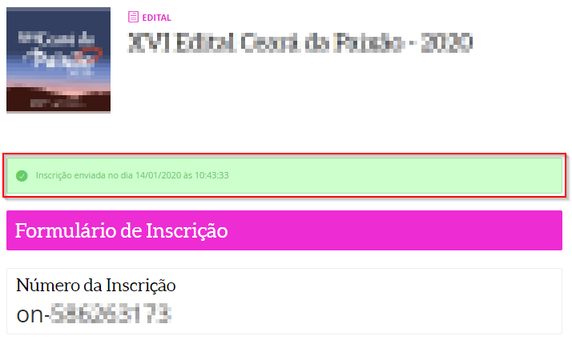

Todas as inscrições que você fizer no Mapas ficam registradas na lista de **minhas inscrições**. Para ter acesso, basta clicar na foto do perfil, lá no canto superior à direita, e depois em `minhas inscrições`. Desta vez, sua inscrição estará na aba **Enviadas** e não mais em **Rascunhos**:

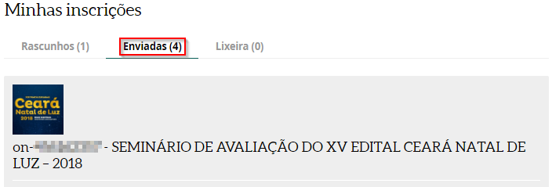

