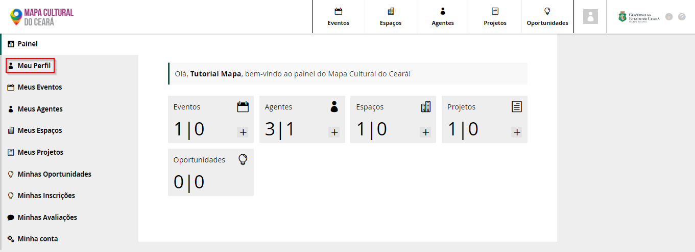

# Meu painel

No Painel de Controle do Mapa da Cultura o Agente Individual tem acesso a ferramentas para edição do perfil e agentes coletivos, criar eventos, espaços e oportunidade. Criar projetos e oportunidades. Acessar as inscrições e avaliações caso você tenha sido escolhido para ser parecerista. 

Para acessar, editas e atualizar informações no seu perfil de Agente individual, basta clicar em `Meu Perfil`

