# Meu painel

No Painel de Controle do Mapa da Cultura você tem acesso a ferramentas para edição e criação de agentes individuais e coletivos, eventos, espaços e oportunidade. Acessar as inscrições e avaliações caso você tenha sido escolhido para ser parecerista. 

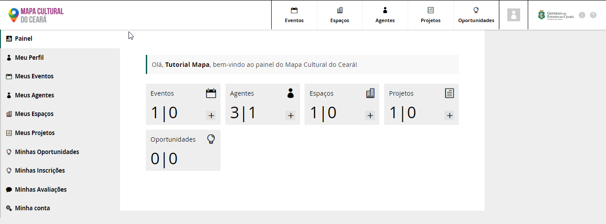

Para acessar e editar o seu perfil de Agente Individual, isso pode ser feito clicando no nome do usuário ou em Meu perfil.  

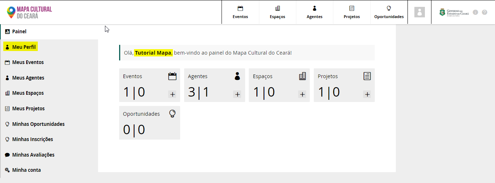

Para criar novos eventos, agente, espaços e projetos basta clicar no botão +. 

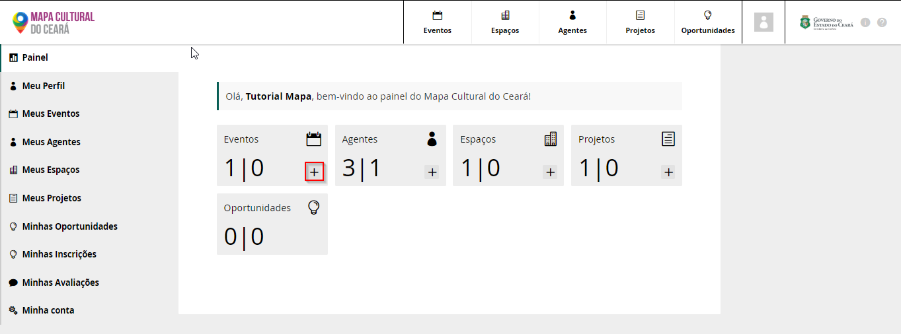

## Meus Eventos

Acessando Meus Eventos, você também pode clicar no botão `Adicionar novo evento`, assim criando eventos. 

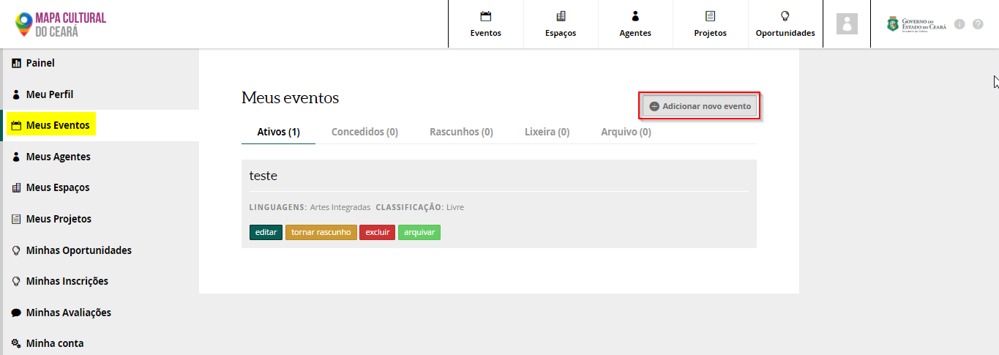

No Painel de Controle acessando meus eventos, você consegue visualizar 5 abas: Ativos, Concedidos, Rascunho, Lixeira e Arquivo.

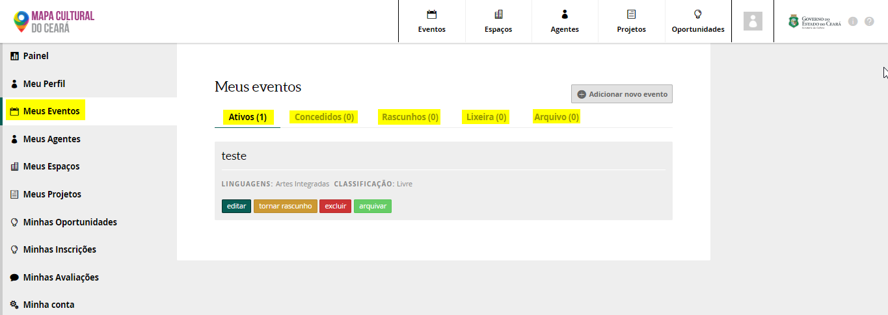

**Ativos:** Eventos criados e publicados. Esse eventos tem botões para : Editar, Tornar rascunho, excluir e arquivar.  
**Concedidos:** Eventos criados e publicados por outros agentes individuais, onde o seu agente individual foi colocado como administrador. Sendo assim, você pode editar e acessar as mesma funções dos editais ativos.   
**Rascunho:** Eventos criados e que não foram publicados.  
**Lixeira:** Eventos criados que foram descartados e jogando na lixeira  
**Aquivo**: Eventos que foram criados, publicados e arquivado pelo agente responsável pelo evento

## Meus Agentes

Neste campo você pode ter acesso aos Agentes Individuais e Coletivos e também adicionar novos agentes, clicando no botão `Adicionar novo agente`. 


O primeiro cadastro na Plataforma tem que ser o Agente Individual


Acessando Meus Agentes voccê pode visualizar todos os seus agentes ativos, concedidos, rascunho, lixeira e arquivo. Para fazer a edição dos Agentes basta clicar no botão `Editar`

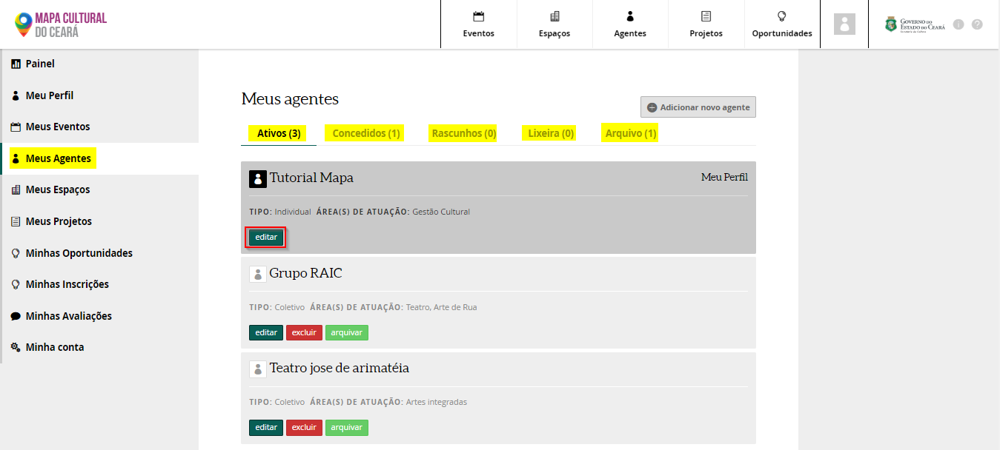

**Ativos:** Agentes publicados no Mapa   
**Concedidos:** São agente onde você consegue editar, mais não foram criados por você. Outra pessoa criou e colocou você como responsável.   
**Rascunhos:** Agente criados, e ainda não fora publicados  
**Lixeiras:** Agentes que foram excluídos  
**Arquivo:** Agentes que foram arquivados

## Meus Espaços

Neste campo você pode criar e editas espaços. Os espaços podem ser Pontos de Cultura, Escolas, Equipamentos Culturais, entre outros.

Para criar um espaço, clique no botão `Adicionar novo espaços`

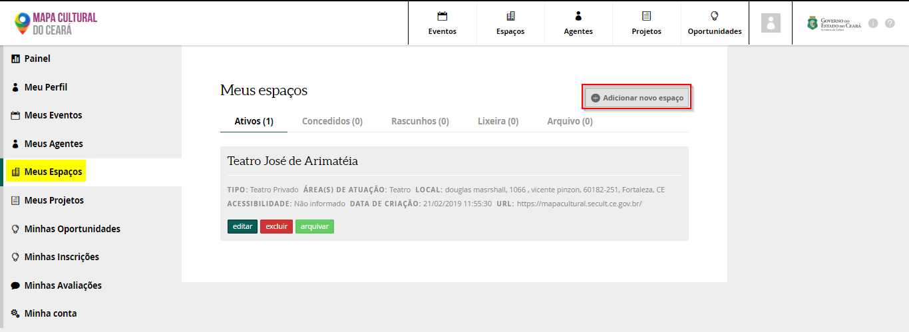

Você pode: editar, excluir e arquivar os espaços, clicando no botões. 

Os espaços podem ser:   
**Ativos**: Espaços publicados  
**Concedidos**: Criado por outro agente individual, que está publicado e o seu perfil de Agente Individual foi colocado como administrador  
**Rascunho**: Espaços não publicados  
**Lixeira**: Espaços colocados na lixeira  
**Arquivo**: Espaços arquivados

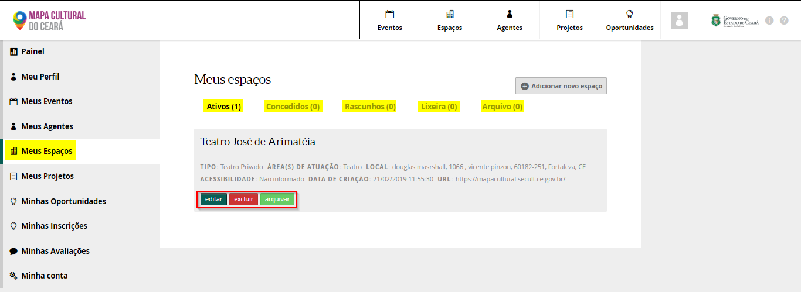

## Meus Projetos

Nesse local você pode acessar os projetos que foram criados e publicados. Para criar projetos basta clicar no botão `Adicionar novos projeto`

No projeto criado e publicado você pode editar as informações, excluir e arquivar  
Os projetos podem ser:   
**Ativos:** Projetos publicados  
**Concedidos:** Projetos criados por outros Agentes Individuais, onde o seu perfil de Agente Individual como administrador  
**Rascunho:** Projetos não publicados  
**Lixeira:** Projetos exluidos  
**Arquivo:** Projetos arquivados

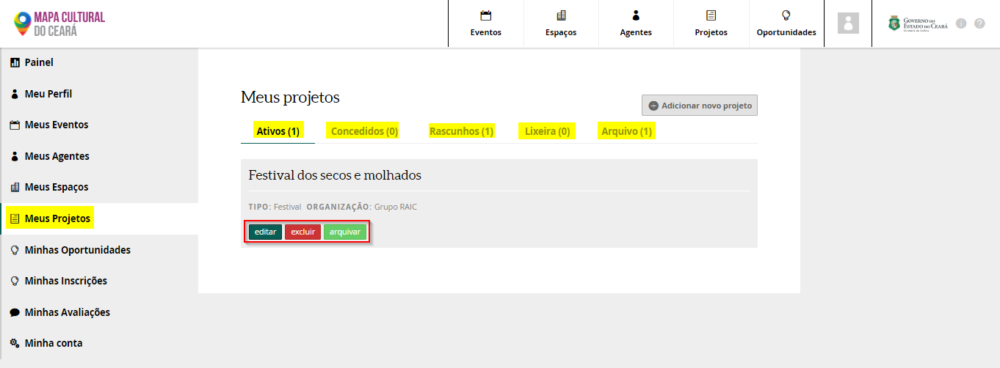

## Minhas Oportunidades

Aqui você tem acesso e gerenciar as oportunidades criadas detros do projetos. 


Ver em Como criar uma oportunidade 


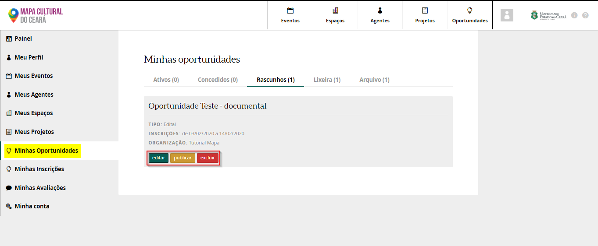

## Minhas Inscrições

Aqui você tem acesso as suas inscrições feitas em oportunidades oferecidas dentro da plataforma do Mapa da Cultura. 

O proponente consegue acessas as inscrições que estão em rascunho, nesse caso, inscrições que ainda não foram enviadas dentro do prazo das inscrições. O proponente pode incluir mais informações, revisar e enviar.


Não deixe para enviar as inscrições no último dia! 


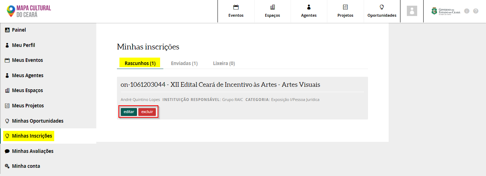

Você também pode acessar as inscrições que foram enviadas, apenas para visualização. Elas não podem ser alteradas.

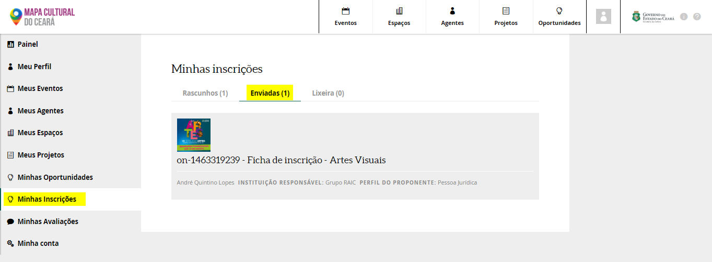

## Minhas Avaliações

Caso você tenha sido selecionado para ser parecerista \(avaliador\) de alguma oportunidade aberta no Mapa da Cultura. Você também pode acessar pelo campo Minhas Avaliações.

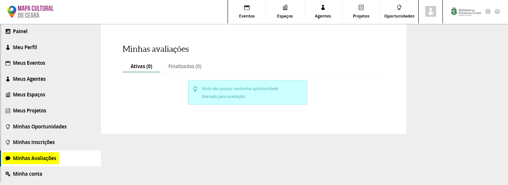

## Minha Conta

Neste campo você pode fazer alterações no acesso a sua conta. Como mudar de e-mail. 

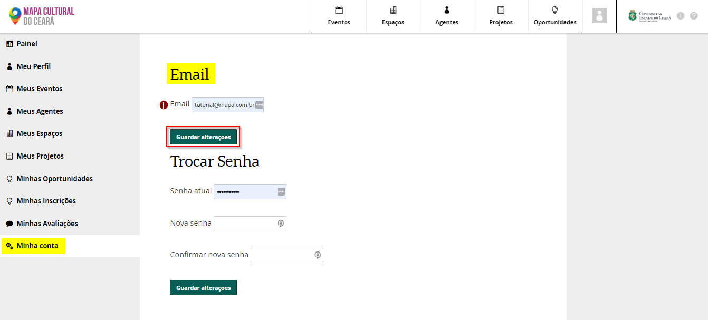

Para alterar o e-mail, basta colocar um e-mail atualizado e clicar no botão `Guardar alterações`. Sua alteração será salva e quando for acessar o mapa novamente, já pode usar o e-mail novo. 

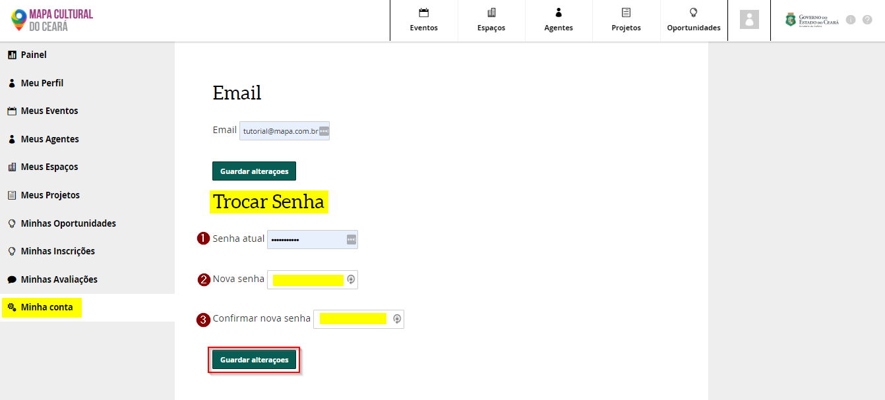

Para tocar de senha basta colocar no campo Nova senha e depois colocar a mesma senha no campo Confirmar nova senha. Em seguida clique no botão `Guarda alterações`. 

Quando for acessar novamente o Mapa da Cultura já pode usar a senha nova. 

