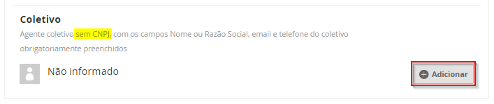

# Passo a passo para inscrição

Bem-vindo ao passo a passo de como fazer a sua inscrição nos Editais da Secretaria da Cultura do Estado do Ceará.

A inscrição será realizada pelo Mapa Cultural do Ceará, uma plataforma livre, gratuita e colaborativa de mapeamento da Secretaria da Cultura do Estado do Ceará sobre cenário cultural cearense. Com ela é possível se programar para conhecer as opções culturais que as cidades cearenses oferecem: shows musicais, espetáculos teatrais, sessões de cinema, saraus, entre outras. Além de conferir a agenda de eventos, você também pode colaborar na gestão da cultura do estado: basta criar seu perfil de agente cultural. A partir deste cadastro, fica mais fácil participar dos editais e programas da Secretaria e também divulgar seus eventos, espaços ou projetos.

O perfil de agente cultural criado no Mapa Cultural do Ceará servirá como base para você participar de futuros editais. Ou seja, uma vez criado o perfil, não será mais preciso preencher os dados cadastrais, basta ter o cuidado de mantê-los atualizados.

Vale lembrar que os Mapas Culturais dos municípios de Fortaleza, Sobral, Juazeiro do Norte, Guaramiranga e Chorozinho estão integrados a Rede dos Mapas Culturais do Ceará. Isso significa que você só precisa de um único cadastro para utilizá-los ;\)

Vamos começar!

### Fazer sua inscrição no Edital 

Cada um dos editais possui uma página específica no Mapa Cultural do Ceará para fazer a inscrição. Você pode encontrar o link para o edital do seu interesse no [http://editais.cultura.ce.gov.br/](https://www.google.com/url?q=http://editais.cultura.ce.gov.br/&sa=D&ust=1579267258263000).

Você também pode encontra as oportunidades na Plataforma no Mapa da Cultura \( [https://mapacultural.secult.ce.gov.br/](https://mapacultural.secult.ce.gov.br/) \). Clique no botão `Oportunidade`, onde você poderá acessar todas as oportunidade abertas e acessar a ficha de inscrição. 

Marque a opção **inscrições abertas**, assim você tera a lista atualizada com as oportunidades que estão em periodo de inscrições. 

Outra opção é digitar o nome do edital em **Buscar oportunidade**. 

Acessando a oportunidade aparecerá um campo para você digitar o nome do agente responsável pela inscrição. Aqui você terá que digitar o nome do seu **agente individual \(Pessoa Física\)**. Se tudo ocorreu bem com o seu cadastro, assim que você digitar, aparecerá o seu perfil. Então selecione o seu agente e depois clique no botão `Fazer inscrição`.

Você verá o **NÚMERO DE INSCRIÇÃO** da ficha de inscrição. Será a partir desse número que você acompanhará o andamento de sua inscrição.

Em alguns editais é necessario escolher a **categoria** da sua inscrição. 

Para indicar a Pessoa Jurídica Proponente, clique no botão `adicionar` no campo **“Instituição responsável”**. 

Clique no botão `adicionar` e digite no campo **"Selecionar Instituição responsável"** o nome da instituição pessoa jurídica proponente, que foi cadastrado como Agente Coletivo.

Selecione a instituição responsável clicando, para seguir com a inscrição.

Para adicionar o Coletivo \(instituição SEM CNPJ\) basta seguir o mesmo procedimento no item Coletivo

### Preencher os campos de informação e subir os arquivos anexos 

As perguntas que são obrigatórias, possuem um **\* \(asterisco\)** no título. 

Pergunta onde você deve digitar um texto. Clique no botão `Informe`, depois digite o texto na caixa que abrirá e clique no botão de `OK`

Pergunta onde você selecionará uma resposta. Primeiro clique no botão `Informe`, depois clique na seta para exibir as opções da lista. Selecione uma opção e clique no botão `OK`.

pergunta para inserir uma data. Você deve iniciar selecionando o ano, depois o mês e por último marcar o dia.

Perguntas onde é preciso subir documentos que estão no seu computador. Para isso, clique no botão `Enviar`, depois em `Escolher arquivo`. Para enviar o arquivo clique no botão `Enviar anexo` 

Se precisar substituir o arquivo, clique no botão`Editar`.


Para se certificar que você subiu o arquivo corretamente, basta clicar no link com o nome do arquivo anexado.


