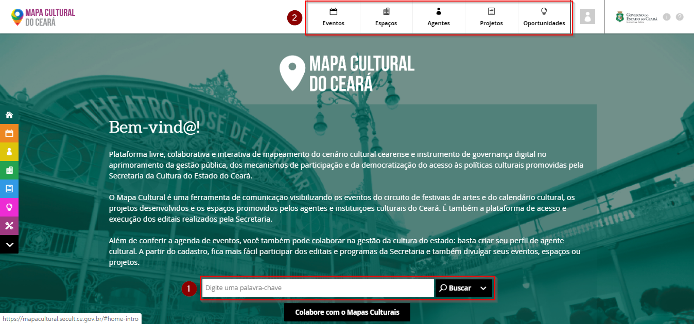
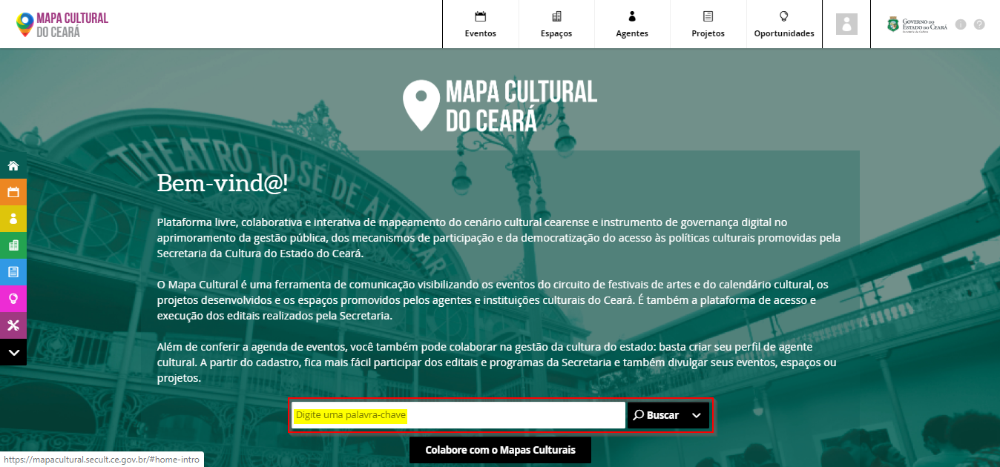
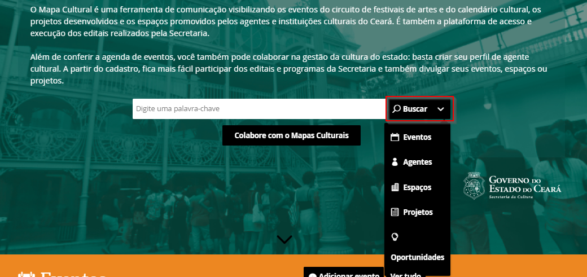
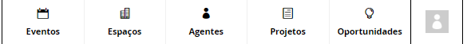
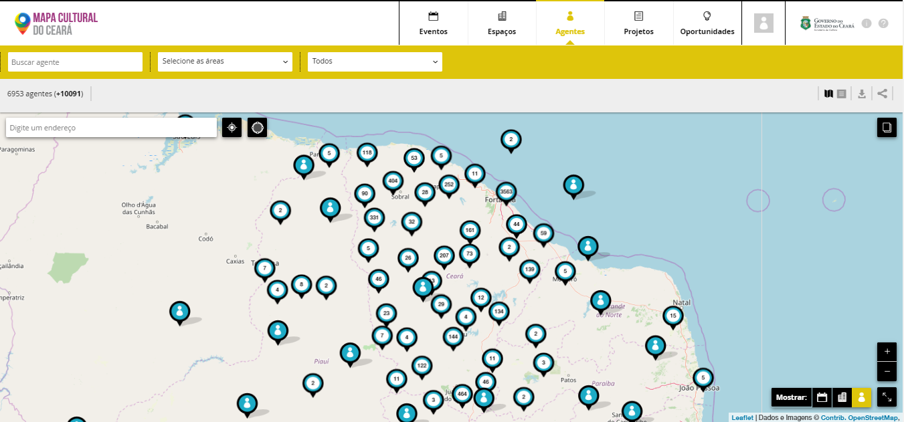
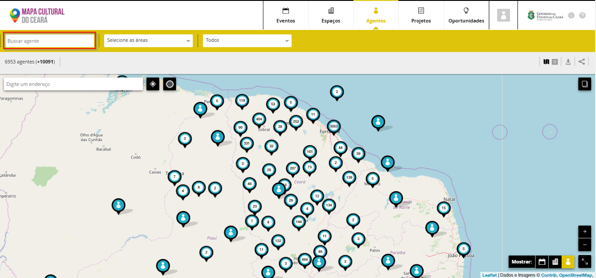
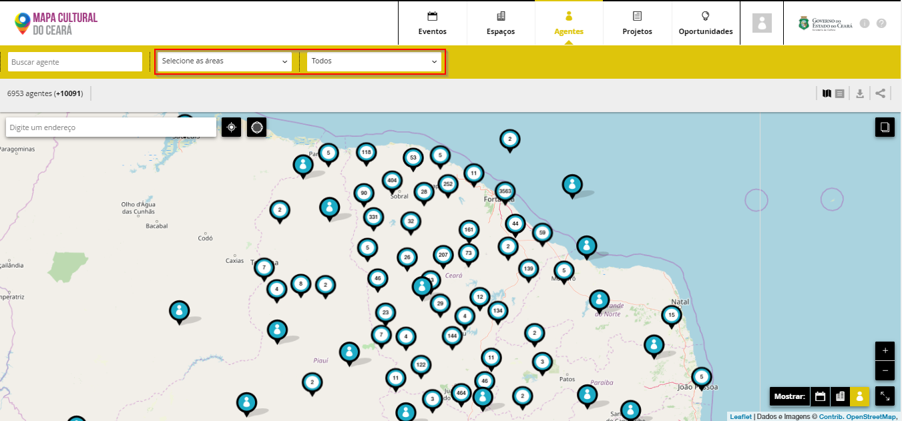
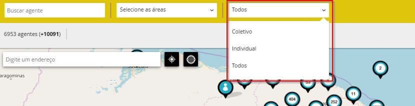

# Como pequisar no Mapa da Cultura

Ao acessar o mapa você terá acesso à home do sistema. Existem 3 áreas que valem a pena comenta

1. Campo de busca geral
2. Cabeçalho com as entidades do mapa


Para fazer buscas não é necessário ter uma conta ou estar logado na plataforma.


O campo de busca onde  lê-se **“digite uma palavra-chave”**

Nesse campo você pode escrever uma palavra chave qualquer: nome de agente, espaço, evento, oportunidade \(ficha de inscrição\) ou projeto, assim como tags que por ventura possa ter sido cadastrada no 
sistema. Depois de escrito verás que existe logo ao lado o botão de `buscar`.

Atente que o sistema não fará busca em todo o banco de dados uma vez que ao clicar em busca 5 opções aparecem: eventos, agentes, espaços, projetos e oportunidades: mapa dos agentes, mapas dos eventos, mapa dos espaços, lista de projetos e lista de oportunidades \(editais com inscrição aberta\). 

Ao escolher uma destas opções o sistema te levará ao mapa que corresponde aos resultados da entidade escolhida: agentes, eventos, espaços,  lista dos projetos ou a lista de oportunidades.

Note que durante toda a navegação o cabeçalho estará presente com os atalhos para as entidades **EVENTO, ESPAÇO, AGENTES, PROJETO e OPORTUNIDADE**.

Você pode ir diretamente a elas para fazer a busca dentro de cada um destes bancos

Cabeçalho com as entidades do mapa

Uma vez dentro de cada uma das entidades existem uma série de opções de filtros para refinar a sua busca. Cada uma das entidades possuem alguns filtros específicos.

 Entidade AGENTES sobre o mapa

Ao clicar sobre Agentes toda a base de agentes cadastrados aparecerá. Como não houve nenhuma busca por palavra-chave, toda a base de agentes que deixou sua localização como pública estará sobre o mapa representado pelos pins.

Como fazer buscas no mapas:

Logo abaixo do campo **‘buscar agentes”** haverá o número total de agentes. O número entre parênteses são os agentes que optaram por deixar privada sua localização. Estes não aparecem no mapa mas aparecem no modo de lista da qual comentaremos mais a frente.

Ao lado do campo **“buscar agentes”** existe o campo **“selecione áreas”**. Esse é um filtro da área de atuação do agente ou agentes\(s\) que se quer buscar.

Mais ao lado existe um campo onde lê-se **“todos”**. Esse é um filtro para buscar agentes individuais, agentes coletivos ou ambos. A diferença entre estes agentes será mencionada mais adiante.


Na faixa cinza logo abaixo dos campos que acabamos de mencionar existe o contador. Conforme for acionando os filtros ou realizando buscas com palavras chaves, logo ao lado do contador, as ações aparecerão para que possa eventualmente editá-las servindo também como lembrete da busca.

