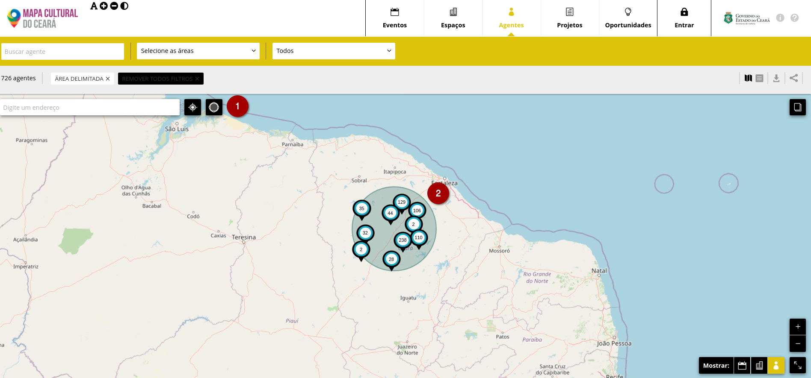
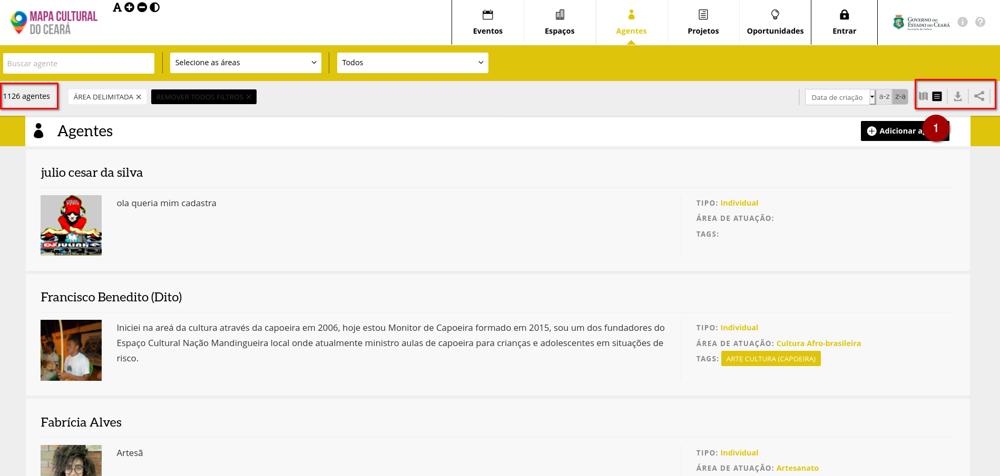
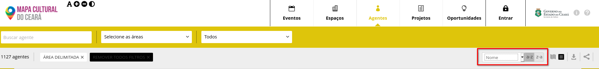
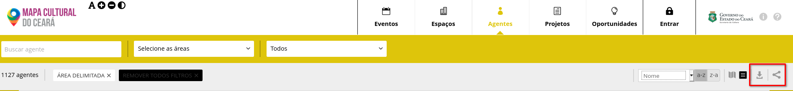

# Como pequisar no Mapa da Cultura


Dica para quem deseja se aprofundar na análise de dados.


### Busca pela página inicial

Ao acessar o mapa você terá acesso à página inicial do sistema. Existem duas áreas que valem a pena comentar.

1. Campo de busca geral
2. Cabeçalho com as entidades do mapa


Para fazer buscas não é necessário ter uma conta ou estar logado na plataforma.


O campo de busca onde  lê-se **“digite uma palavra-chave”**

Nesse campo você pode escrever uma palavra chave qualquer: nome de agente, espaço, evento, oportunidade \(ficha de inscrição\) ou projeto, assim como tags que por ventura possa ter sido cadastrada no 
sistema. Depois de escrito verás que existe logo ao lado o botão de `buscar`.

Atente que o sistema não fará busca em todo o banco de dados uma vez que ao clicar em busca cinco opções aparecem: eventos, agentes, espaços, projetos e oportunidades: mapa dos agentes, mapas dos eventos, mapa dos espaços, lista de projetos e lista de oportunidades \(incluindo editais\). 

Ao escolher uma destas opções o sistema te levará ao mapa que corresponde aos resultados da entidade escolhida: agentes, eventos, espaços,  lista dos projetos ou a lista de oportunidades.

Note que durante toda a navegação o cabeçalho estará presente com os atalhos para as entidades **`EVENTOS`, `ESPAÇOS`, `AGENTES`, `PROJETOS` e `OPORTUNIDADES`**.

### Busca pela entidade

Você pode ir diretamente a elas para fazer a busca dentro de cada um destes bancos.

Uma vez dentro de cada uma das entidades existem uma série de opções de filtros para refinar a sua busca. Cada uma das entidades possuem alguns filtros específicos.

Ao clicar sobre a entidade `Agentes` toda a base de agentes cadastrados, com localização pública, aparecerá no mapa. Cada ponto mostra a quantidade de agentes cadastrados na região. Você pode ampliar o zom para visualizar cada agente individualmente.

### Como filtrar a busca

Logo abaixo do campo **‘buscar agentes”** haverá o número total de agentes. O número entre parênteses são os agentes que optaram por deixar privada sua localização. Estes não aparecem no mapa mas aparecem no modo de lista da qual comentaremos mais a frente.

Ao lado do campo **“buscar agentes”** existe o campo **“selecione áreas”**. Esse é um filtro da área de atuação do agente ou agentes\(s\) que se quer buscar.

Mais ao lado existe um campo onde lê-se **“todos”**. Esse é um filtro para buscar agentes individuais, agentes coletivos ou ambos. A diferença entre estes agentes será mencionada mais adiante.


Na faixa cinza logo abaixo dos campos que acabamos de mencionar existe o contador. Conforme for acionando os filtros ou realizando buscas com palavras chaves, logo ao lado do contador, as ações aparecerão para que possa eventualmente editá-las servindo também como lembrete da busca.

Também é possível filtrar os agentes a partir de uma determinada área. Basta  clicar na ferramenta de seleção de área e depois clicar e arrastar o mouse na região do mapa que se deseja analisar. No exemplo abaixo foram encontrados 726 agentes.


Estas opções de filtro também estão disponíveis para a busca de eventos e espaços.


### Visualizar resultados no modo de lista

Para visualizar as informações no modo de lista, basta clicar no ícone na lateral direita. 

Todos os agentes selecionados aparecerão junto com as seguintes informações:

* Nome social
* Foto
* Descrição curta
* Tipo de agente \(individual ou coletivo\)
* Área de atuação
* Tags \(palavras-chaves\)

Clicando no foto você poderá acessar o perfil do agente cadastro.


Neste exemplo utilizamos o mesmo filtro da área delimitada, mas dessa vez o sistema contabilizou 1.126 agentes. Isso ocorre porque no modo de visualização de lista são considerados todos os cadastros de uma determinada área incluindo aqueles que optaram por tornar sua localização com privada, pois no modo listagem não se consegue individualizar a localização do agente. 


No modo listagem é possível organizar o resultado de acordo com o nome ou data de criação e por ordem crescente ou decrescente.

### Exportar para planilha ou compartilhar o resultado da busca

Por fim é possível exportar o resultado da sua busca para uma planilha, basta clicar no botação de exportar dados que fica o lado do botão de visualizar resultado como listagem. O sistema irá baixar uma planilha no formato excel \(.xls\) com todos os dados públicos dos agentes selecionados incluindo os contatos públicos e os links para redes sociais.


O sistema pode demorar para exportar buscas com muitos resultados \(acima de 5 mil\).



Com o auxílio de um programador você pode fazer buscas mais complexas utilizando a API do mapa cultural &gt;&gt; [http://docs.mapasculturais.org/apidoc/index.html?doctype=api](http://docs.mapasculturais.org/apidoc/index.html?doctype=api)


 E o botão para compartilhar o resultado da pesquisa esta ao lado esquerdo do botão de exportar. Ele gerará o link  da sua pesquisa pesquisa para você compartilhar com outras pessoas. Esse foi o link gerado para a nossa busca por região:




Não é preciso ter cadastro no mapa para visualizar as buscas.



As informações do link que você gerou serão autalizadas automaticamente, ou seja, se novos agentes entrarem no mapas e estiverem dentro do filtro especificado, eles automaticamente aparecerão no link de que você compartilhou.


